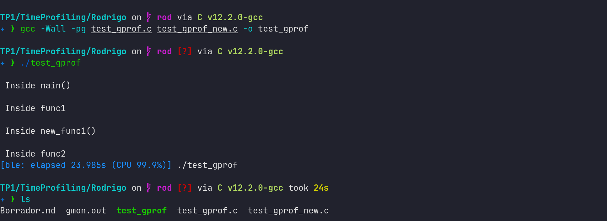
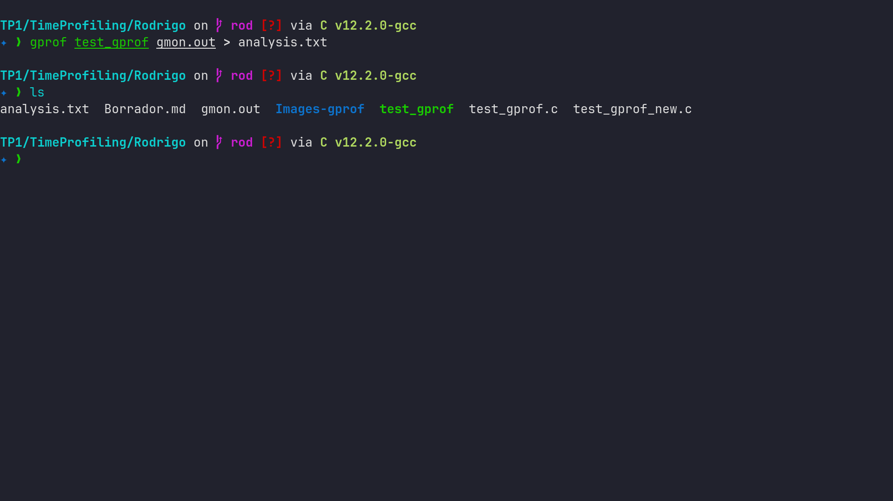
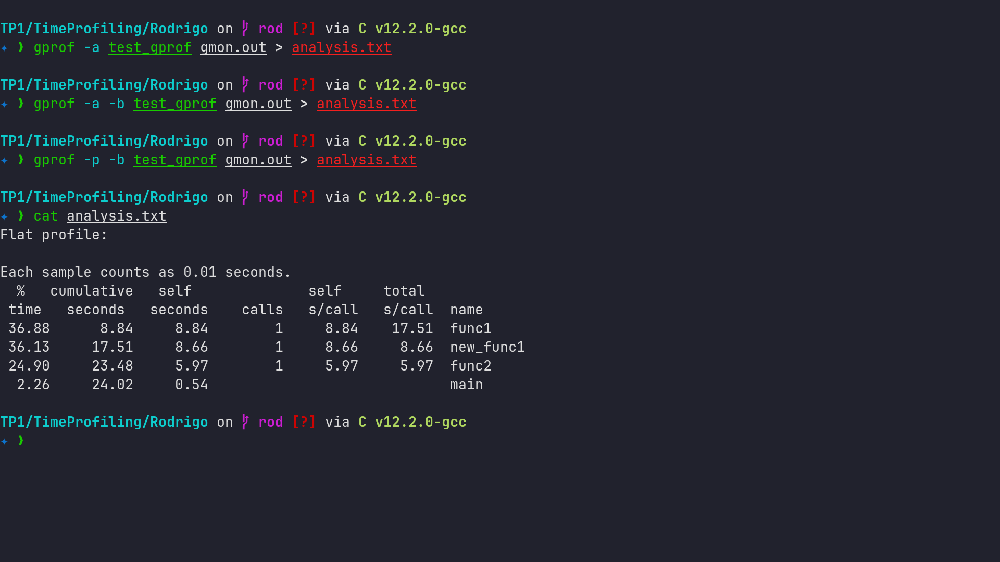
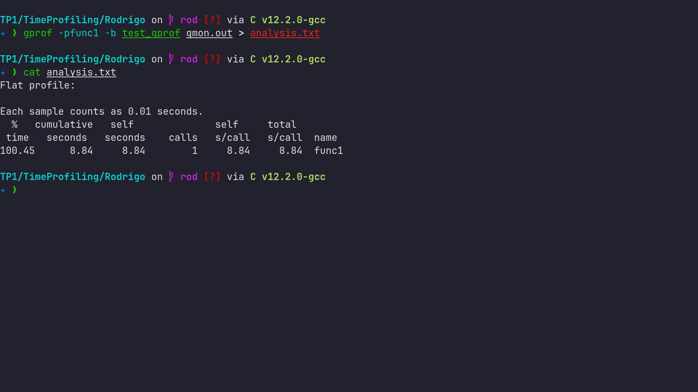
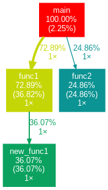
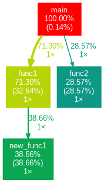
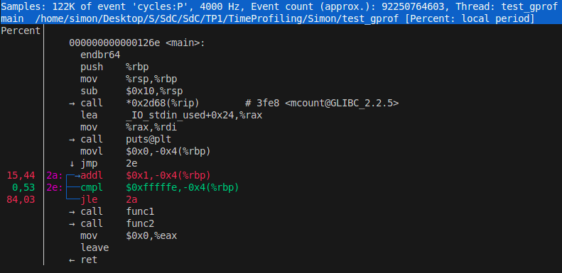
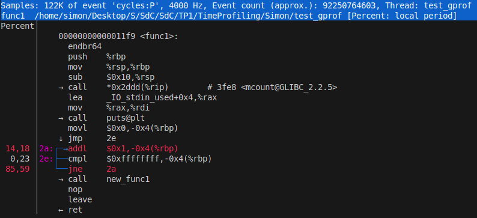
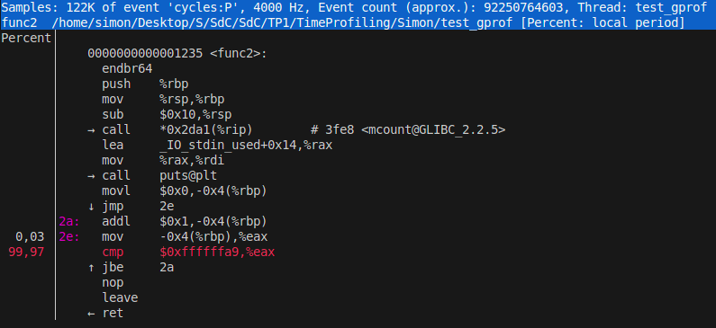

# Trabajo Práctico N°1

### `Breaking Bytes`

- SAILLEN, Simón.
- VARGAS, Rodrigo Sebastian.
- ZÚÑIGA, Guillermo Rubén Darío.

## Introducción

El objetivo de este informe es aplicar los conocimientos adquiridos sobre el rendimiento y la performance de los sistemas computacionales, con el fin de tomar decisiones informadas sobre el hardware y optimizar el código. 

Esta tarea se divide en tres partes: la primera consiste en utilizar benchmarks de terceros para evaluar y comparar el rendimiento de distintos componentes de hardware, la segunda se centra en el análisis del rendimiento de nuestro propio código mediante herramientas de time profiling y la tercera es una actividad practica realizada sobre una ESP32 para analizar el rendimiento en distintas condiciones.

## Desarrollo

### Parte 1: Benchmarks y Rendimiento

#### Benchmarks para tareas diarias

| **Tarea Diaria**                        | **Benchmark Representativo** | **Descripción**                                                                                                                                      |
| --------------------------------------- | ---------------------------- | ---------------------------------------------------------------------------------------------------------------------------------------------------- |
| **Desarrollo de software**              | `Phoronix Test Suite`        | Suite completa de benchmarks que evalúa el rendimiento del sistema en diversas tareas, incluyendo compilación y rendimiento de aplicaciones.         |
|                                         | `time make -j$(nproc)`       | Comando de terminal utilizado para medir el tiempo de compilación en proyectos grandes, aprovechando todos los núcleos de CPU disponibles.           |
|                                         | `Cinebench R23`              | Benchmark que mide el rendimiento de la CPU en tareas de renderizado 3D, útil para evaluar el rendimiento de procesadores en entornos de desarrollo. |
| **Redes y comunicación**                | `iPerf`                      | Herramienta de línea de comandos que mide el rendimiento de la red, específicamente el ancho de banda y la latencia, en pruebas TCP/UDP.             |
|                                         | `netperf`                    | Benchmark que evalúa el rendimiento de redes, incluyendo el rendimiento de TCP y UDP en condiciones de red controladas.                              |
|                                         | `ping -f`                    | Comando para probar la conectividad de red y medir la latencia mediante el envío de paquetes ICMP en modo "flood".                                   |
|                                         | `Wireshark` (análisis)       | Herramienta de análisis de paquetes de red que permite inspeccionar el tráfico y rendimiento de la red en tiempo real.                               |
| **Navegación web**                      | `JetStream 2`                | Benchmark que evalúa el rendimiento de los navegadores en la ejecución de aplicaciones web complejas, como JavaScript.                               |
|                                         | `Speedometer 2.0`            | Mide el rendimiento de navegación web, evaluando la capacidad de respuesta del navegador al interactuar con aplicaciones web dinámicas.              |
|                                         | `MotionMark`                 | Benchmark que evalúa el rendimiento gráfico de los navegadores, especialmente en la ejecución de gráficos y animaciones.                             |
|                                         | `Octane`                     | Benchmark enfocado en medir el rendimiento de JavaScript en los navegadores web, evaluando cómo manejan aplicaciones y scripts complejos.            |
| **Multitarea**                          | `Geekbench Multi-Core`       | Mide el rendimiento del procesador en tareas de múltiples núcleos, evaluando cómo maneja tareas que requieren alta concurrencia.                     |
|                                         | `PCMark`                     | Evaluación de rendimiento en tareas diarias de productividad, incluyendo multitarea, como navegar y usar aplicaciones ofimáticas.                    |
|                                         | `Phoronix Multitasking`      | Parte de la suite Phoronix, mide el rendimiento del sistema bajo condiciones de multitarea intensiva.                                                |
| **Reproducción de video y streaming**   | `YouTube Playback Benchmark` | Evalúa el rendimiento de la CPU y la GPU en la reproducción de contenido en YouTube, midiendo la fluidez y el uso de recursos.                       |
|                                         | `VLC Benchmark`              | Mide el rendimiento de la decodificación de video utilizando el popular reproductor multimedia VLC.                                                  |
| **Gaming**                              | `3DMark`                     | Benchmark que mide el rendimiento gráfico y de CPU en juegos 3D, evaluando la capacidad de procesamiento de los gráficos del sistema.                |
|                                         | `Unigine Heaven`             | Test gráfico que evalúa el rendimiento 3D de la GPU en entornos de alta demanda gráfica, simulando juegos y aplicaciones visualmente intensivas.     |
| **Servidores - Procesamiento de datos** | `SPEC CPU`                   | Benchmark de rendimiento de CPU que mide el desempeño de la CPU en tareas intensivas como la compilación y simulaciones científicas.                 |
|                                         | `Sysbench`                   | Herramienta para evaluar el rendimiento de CPU, memoria y bases de datos, utilizada para pruebas de servidores y sistemas.                           |
|                                         | `TPC-C Benchmark`            | Benchmark que evalúa el rendimiento de las bases de datos transaccionales simulando un entorno de servidor de base de datos real.                    |
|                                         | `fio` (almacenamiento)       | Benchmark que mide el rendimiento de entrada/salida de almacenamiento, evaluando la capacidad de lectura/escritura de discos y SSDs.                 |

#### Rendimiento al compilar el kernel de Linux

El rendimiento de un sistema se mide por su capacidad para completar una tarea en un tiempo determinado. Utilizando los tiempos de ejecución, podemos calcular el rendimiento absoluto:

$$\text{Rendimiento} = \frac{1}{T}$$

La siguiente tabla muestra los tiempos y rendimientos de los procesadores:

| Procesador        | Tiempo (s) | Rendimiento absoluto (1/s) |
| ----------------- | ---------- | -------------------------- |
| Intel i5-13600K   | 83 ± 3     | 0.012                      |
| AMD Ryzen 9 5900X | 97 ± 6     | 0.010                      |
| AMD Ryzen 9 7950X | 53 ± 3     | 0.019                      |

Para calcular la aceleración del **AMD Ryzen 9 7950X 16-Core**, usamos la fórmula de **Speedup**:

$$\text{Speedup} = \frac{T_{\text{base}}}{T_{\text{Ryzen 9 7950X}}}$$

##### Comparación con Intel Core i5-13600K:

$$\text{Speedup} = \frac{83}{53} = 1.566$$

##### Comparación con AMD Ryzen 9 5900X:

$$\text{Speedup} = \frac{97}{53} = 1.830$$

##### Aceleracion al usar AMD Ryzen 9 7950X 16-Core

El **Ryzen 9 7950X** es **1.57 veces más rápido** que el **i5-13600K** y **1.83 veces más rápido** que el **Ryzen 9 5900X** al compilar el kernel de Linux. Además, su eficiencia energética lo hace ideal para tareas relacionadas a la compilación y servidores, siendo una opción destacada por su rendimiento y economía de energía.

### Parte 2: Time Profiling

> [!NOTE] En esta parte cada integrante realizó la misma experiencia, pero mostraremos imagenes de solo 1 para evitar repeticiones.

#### Herramienta GNU GCC Profiling

Se realizó el tutorial sobre la generación de archivos de perfil en los códigos `test_gprof.c` y `test_gprof_new.c`.

Se agregó la opción '-pg' en el
paso de compilación. Se puede observar la creacion del binario `test_gprof`.



Luego de ejecutarlo se crea el archivo `gmon.out`.

Se ejecutó posteriormente la herramienta **gprof** produciendo el archivo de análisis.



##### Impresion del archivo `analysis.txt` generado:

```text
Flat profile:

Each sample counts as 0.01 seconds.
  %   cumulative   self              self     total           
 time   seconds   seconds    calls   s/call   s/call  name    
 41.43     12.26    12.26        1    12.26    20.89  func1
 29.20     20.90     8.64        1     8.64     8.64  func2
 29.17     29.53     8.63        1     8.63     8.63  new_func1
  0.20     29.59     0.06                             main

 %         the percentage of the total running time of the
time       program used by this function.

cumulative a running sum of the number of seconds accounted
 seconds   for by this function and those listed above it.

 self      the number of seconds accounted for by this
seconds    function alone.  This is the major sort for this
           listing.

calls      the number of times this function was invoked, if
           this function is profiled, else blank.

 self      the average number of milliseconds spent in this
ms/call    function per call, if this function is profiled,
	   else blank.

 total     the average number of milliseconds spent in this
ms/call    function and its descendents per call, if this
	   function is profiled, else blank.

name       the name of the function.  This is the minor sort
           for this listing. The index shows the location of
	   the function in the gprof listing. If the index is
	   in parenthesis it shows where it would appear in
	   the gprof listing if it were to be printed.

Copyright (C) 2012-2024 Free Software Foundation, Inc.

Copying and distribution of this file, with or without modification,
are permitted in any medium without royalty provided the copyright
notice and this notice are preserved.

		     Call graph (explanation follows)


granularity: each sample hit covers 4 byte(s) for 0.03% of 29.59 seconds

index % time    self  children    called     name
                                                 <spontaneous>
[1]    100.0    0.06   29.53                 main [1]
               12.26    8.63       1/1           func1 [2]
                8.64    0.00       1/1           func2 [3]
-----------------------------------------------
               12.26    8.63       1/1           main [1]
[2]     70.6   12.26    8.63       1         func1 [2]
                8.63    0.00       1/1           new_func1 [4]
-----------------------------------------------
                8.64    0.00       1/1           main [1]
[3]     29.2    8.64    0.00       1         func2 [3]
-----------------------------------------------
                8.63    0.00       1/1           func1 [2]
[4]     29.2    8.63    0.00       1         new_func1 [4]
-----------------------------------------------

 This table describes the call tree of the program, and was sorted by
 the total amount of time spent in each function and its children.

 Each entry in this table consists of several lines.  The line with the
 index number at the left hand margin lists the current function.
 The lines above it list the functions that called this function,
 and the lines below it list the functions this one called.
 This line lists:
     index	A unique number given to each element of the table.
		Index numbers are sorted numerically.
		The index number is printed next to every function name so
		it is easier to look up where the function is in the table.

     % time	This is the percentage of the `total' time that was spent
		in this function and its children.  Note that due to
		different viewpoints, functions excluded by options, etc,
		these numbers will NOT add up to 100%.

     self	This is the total amount of time spent in this function.

     children	This is the total amount of time propagated into this
		function by its children.

     called	This is the number of times the function was called.
		If the function called itself recursively, the number
		only includes non-recursive calls, and is followed by
		a `+' and the number of recursive calls.

     name	The name of the current function.  The index number is
		printed after it.  If the function is a member of a
		cycle, the cycle number is printed between the
		function's name and the index number.


 For the function's parents, the fields have the following meanings:

     self	This is the amount of time that was propagated directly
		from the function into this parent.

     children	This is the amount of time that was propagated from
		the function's children into this parent.

     called	This is the number of times this parent called the
		function `/' the total number of times the function
		was called.  Recursive calls to the function are not
		included in the number after the `/'.

     name	This is the name of the parent.  The parent's index
		number is printed after it.  If the parent is a
		member of a cycle, the cycle number is printed between
		the name and the index number.

 If the parents of the function cannot be determined, the word
 `<spontaneous>' is printed in the `name' field, and all the other
 fields are blank.

 For the function's children, the fields have the following meanings:

     self	This is the amount of time that was propagated directly
		from the child into the function.

     children	This is the amount of time that was propagated from the
		child's children to the function.

     called	This is the number of times the function called
		this child `/' the total number of times the child
		was called.  Recursive calls by the child are not
		listed in the number after the `/'.

     name	This is the name of the child.  The child's index
		number is printed after iEn conclusión, este informe ha logrado aplicar de manera efectiva los conocimientos teóricos sobre el rendimiento y la performance de sistemas computacionales a través de un enfoque práctico y exhaustivo. Mediante la utilización de benchmarks externos, el análisis detallado de nuestro propio código con herramientas de profiling y la experimentación en un entorno embebido como la ESP32, hemos obtenido una comprensión profunda de los factores que influyen en el rendimiento. Los resultados obtenidos en cada una de las etapas nos proporcionan la información necesaria para tomar decisiones fundamentadas sobre la selección de hardware y para implementar estrategias de optimización de código más eficientes, cumpliendo así con el objetivo principal de este informe.
 If there are any cycles (circles) in the call graph, there is an
 entry for the cycle-as-a-whole.  This entry shows who called the
 cycle (as parents) and the members of the cycle (as children.)
 The `+' recursive calls entry shows the number of function calls that
 were internal to the cycle, and the calls entry for each member shows,
 for that member, how many times it was called from other members of
 the cycle.

Copyright (C) 2012-2024 Free Software Foundation, Inc.

Copying and distribution of this file, with or without modification,
are permitted in any medium without royalty provided the copyright
notice and this notice are preserved.

Index by function name

   [2] func1                   [1] main
   [3] func2                   [4] new_func1

```

Se personalizó el archivo con distintos comandos, quedando en un archivo final mas resumido.





Posteriormente se generaron graficos de los resultados utilizando `gprof2dot`:

Codigo para generar los graficos:

```bash
gprof test_gprof gmon.out | gprof2dot -s | dot -Tpng -o profile.png
```

Graficos generados:

<div style="display: flex; justify-content: center; gap: 10px;">
    
    
    
</div>

#### Herramienta Perf

Para este caso, se realizó el perfil del programa con Linux Perf.

Esta herramienta es interesante ya que permite, entre otras cosas, ver en codigo ensamblador a las distintas funciones del programa.








### Parte 3: ESP32

Para la realización de esta parte generamos el siguiente código en Arduino que utilizamos en una **ESP32 Devkit V1**.

```c++
//  Available CPU clock frequency values:
//  240, 160, 80    <<< For all XTAL types
//  40, 20, 10      <<< For 40MHz XTAL
//  26, 13          <<< For 26MHz XTAL
//  24, 12          <<< For 24MHz XTAL

// Definitions
#define LED_BUILTIN 2     // Led on ESP32 board
#define DELAY 1e6         // 'for' delay amount
#define FREQUENCY 160     // CPU frequency

int xtal_freq;
int cpu_freq;
int num = 0;

void setup() {
  int n_cycles;
  float exec_time;

  // Setup
  Serial.begin(115200);           // Serial baudrate
  pinMode(LED_BUILTIN, OUTPUT);   // Set pin as output
  setCpuFrequencyMhz(FREQUENCY);  // Set desired CPU clock

  // Get crystal and CPU frequencies
  xtal_freq = getXtalFrequencyMhz();
  cpu_freq = getCpuFrequencyMhz();

  Serial.printf("XTAL Frequency = %d MHz\n", xtal_freq);
  Serial.printf("CPU Frequency = %d MHz\n", cpu_freq);

  // Start timing
  int n_i = xthal_get_ccount();

  // Begin program
  for(int i = 0; i < DELAY; i++){
    num++;
  }

  // End timing
  int n_f = xthal_get_ccount();

  // Calculate CPU cycles
  n_cycles = n_f - n_i;
  // Calculate execution time
  exec_time = float(n_cycles) / float(cpu_freq) * 1000.0;

  // Display
  Serial.printf("Execution clock cycles = %d\n", n_cycles);
  Serial.printf("Execution time = %.2f ns\n", exec_time);
}

void loop() {
  // Nothing to loop
}
```

Donde conseguimos los siguientes resultados:

#### Frecuencia = 240 MHz

```
XTAL Frequency = 40 MHz  
CPU Frequency = 240 MHz  
Execution clock cycles = 22  
Execution time = 91.67 ns  
```

#### Frecuencia = 160 MHz

```
XTAL Frequency = 40 MHz  
CPU Frequency = 160 MHz  
Execution clock cycles = 22  
Execution time = 137.50 ns  
```

#### Frecuencia = 80 MHz

```
XTAL Frequency = 40 MHz  
CPU Frequency = 80 MHz  
Execution clock cycles = 22  
Execution time = 275.00 ns  
```

##### Conclusión

Como se puede observar, el tiempo de programa se reduce a la mitad cuando la frecuencia del procesador se duplica.

## Conclusiones

En este informe se ha logrado aplicar los conocimientos teóricos sobre el rendimiento y la eficiencia de sistemas computacionales a través de una investigación de benchmarks que evalúan distintos recursos del hardware, según las actividades que se realizan con más frecuencia por los integrantes del grupo. Además de una comparación del rendimiento de algunos procesadores gracias a la observación de estos benchmarks.

Por otro lado, se obtuvo una mejor comprensión del rendimiento realizando un análisis de time profiling sobre un código propio y se experimentó con una ESP32, midiendo el tiempo de ejecucion de un programa embebido en éste, concluyendo que el tiempo de ejecucion es inversamente proporcional a la frecuencia del CPU, y por lo tanto, una mayor frecuencia permite un mejor rendimiento.
