# Tutorial Time Profiling

## Herramienta GNU GCC Profiling

Se realizó el tutorial sobre la generación de archivos de perfil en los códigos `test_gprof.c` y `test_gprof_new.c`.  

Se agregó la opción '-pg' en el
paso de compilación. Se puede observar la creacion del binario `test_gprof`.
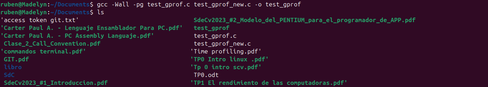
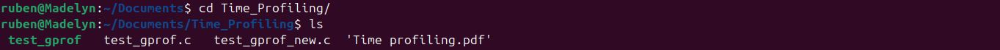

Luego de ejecutarlo se crea el archivo `gmon.out`.
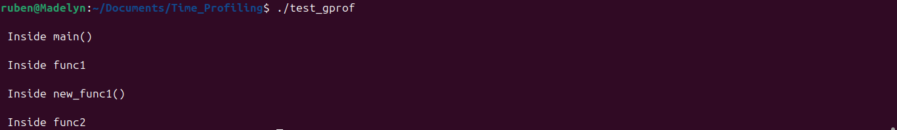

Se ejecutó posteriormente la herramienta Gprof produciendo el archivo de análisis.

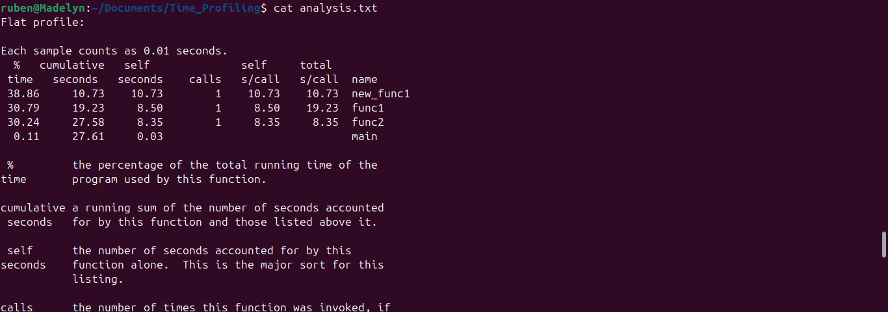

Se personalizó el archivo con distintos comandos.
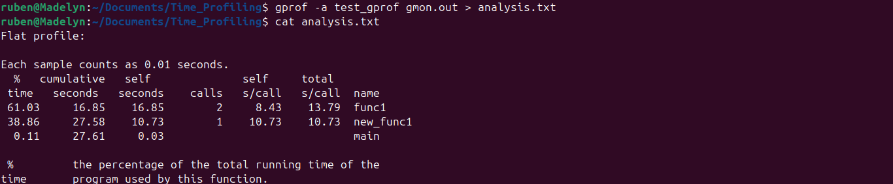
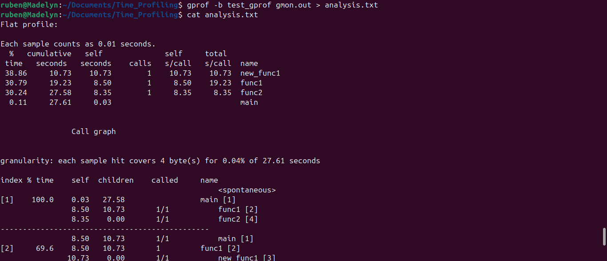
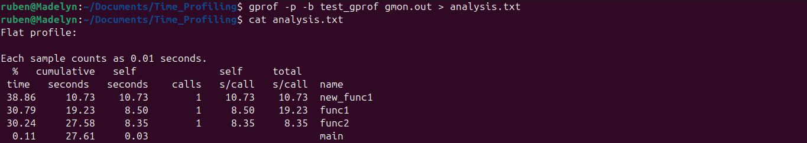
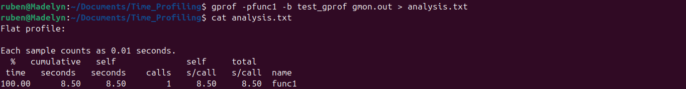

Para ver un gráfico de la salida de gprof, se utilizó gprof2dot que genera una imagen .png del mismo.
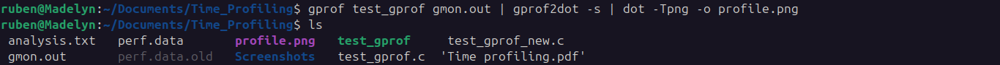

## Herramienta Perf
Para este caso, se realizó el perfil del programa con Linux Perf.
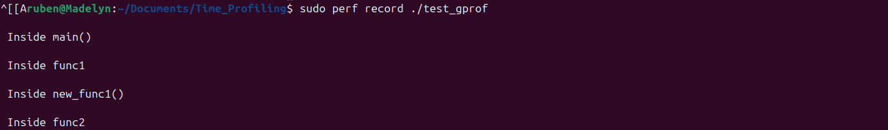
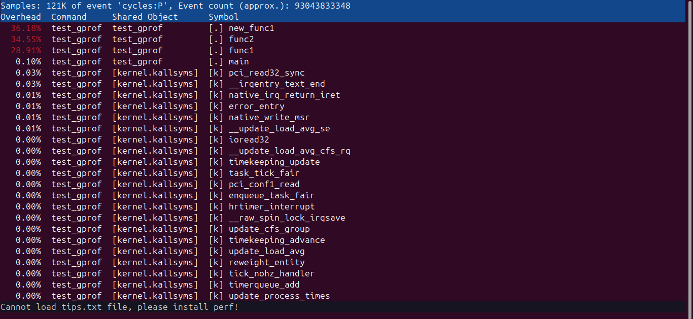

Esta herramienta es interesante ya que permite ver en codigo ensamblador a las distintas funciones del programa.
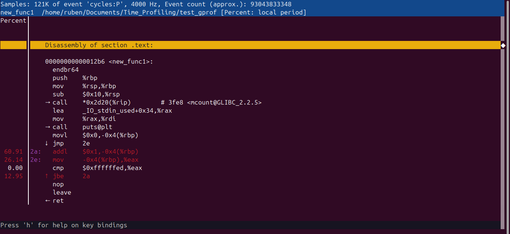
