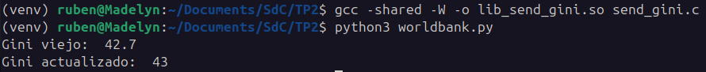
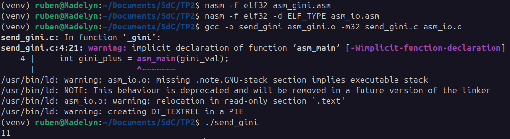

# Trabajo Práctico N°2: Stack Frame

### `Breaking Bytes`

- SAILLEN, Simón.
- VARGAS, Rodrigo Sebastian.
- ZÚÑIGA, Guillermo Rubén Darío.

## Introducción

Se diseñó e implementó una interfaz que adquiere el índice GINI de un país, realizando una consulta a la base de datos del banco mundial (https://api.worldbank.org/v2/en/country/all/indicator/SI.POV.GINI?format=json&date=2011:2020&per_page=32500&page=1&country=%22Argentina%22), y realiza un cálculo matemático utilizando éste índice. La interfaz consiste de tres capas: una superior realizada en Python que recupera el indice GINI, una intermedia que realiza una conversion de tipo de dato y una inferior que realiza la suma. Las capas se comunican entre si mediante el stack.

## Desarrollo

### 1° Iteración: Uso de Python y C

En este primer caso se realizo la suma del índice en C sin Ensamblador. El índice es convertido a entero en Python y luego es sumado en C.

Para esto se utilizó la librería `requests` para enviar solicitudes HTTP a la página del banco mundial, y `ctypes` para que Python pueda llamar a una función de una librería compartida de C.

```Python
# worldbank.py

import requests
import ctypes

# Specify country and year
country_searched = "Argentina"
year_searched = "2020"

api_url = "https://api.worldbank.org/v2/en/country/all/indicator/SI.POV.GINI?format=json&date=2011:2020&per_page=32500&page=1&country=%22Argentina%22"

# Search GINI index for the specified country and year
def fetch_gini_index(country_searched, year_searched) -> int:
    response = requests.get(api_url)
    data = response.json()
    gini_val = 0
                
    for item in data[1]:
        country = item.get('country', {}).get('value')
        year = item.get('date')
        
        if country == country_searched and year == year_searched:
            gini_val = item.get('value')
            break
                
    return gini_val

# Load C library
lib_send_gini = ctypes.CDLL('./lib_send_gini.so', mode=ctypes.RTLD_GLOBAL)
    
# Set argument and return types
lib_send_gini._gini.argtypes = (ctypes.c_int,)
lib_send_gini._gini.restype = (ctypes.c_int)

# Define python function
def send_gini(num):
    return lib_send_gini._gini(num)

old_gini = fetch_gini_index(country_searched, year_searched)

print("Gini viejo: ", old_gini)
print("Gini actualizado: ", send_gini(int(old_gini)))
```

```C
// send_gini.c

int _gini(int gini_val){
    return gini_val + 1;
}
```



### 2° Iteración: Uso de C y Assembly

En este caso se enfocó en lograr llamar a un subprograma de ensamblador en C, y para esto se requirió el conocimiento de la convencion de llamada de C. Con esto se logró enviar un entero fijo al subprograma para incrementar en 1 su valor.

```C
// old_send_gini.c

int _gini(int gini_val){
    int gini_plus = asm_main(gini_val);
    return gini_plus;
}

int main(){
    float gini_actual = 10.0;
    int gini_truncado = (int)gini_actual;
    printf("%d",_gini(gini_truncado));
    return 0;
}
```

```Assembly
; asm_gini.asm

; subroutine asm_main
;
; Input Parameter:
;   gini_val    - what to increment to (at [ebp + 8])
; Return value:
;   gini_val + 1

%include "asm_io.inc"

; Code
segment .text
        global  asm_main
asm_main:
        enter   0,0               ; Setup routine
        
        mov     eax,[ebp+8]
        inc     eax               ; Add 1 to [ebp+8] (gini_val)

        leave                     ; Return to C
        ret
```



### 3° Iteración: Stack Frame Completo (Python - C - Assembly)

En esta etapa nos enfocamos en lograr unir y comunicar todas las capas. Sin embargo nos encontramos con un problema en el camino, al utilizar `Assembly x86` había una incompatibilidad con `Python` ya que utiliza un interpretador de `x64`, para solucionar esto utilizamos la librería `msl-loadlib`, que permite cargar una librería compartida de 32bits en el interpreter de 64bits en Python.

```Python
# asm_worldbank.py

import requests
from my_client import MyClient


def fetch_gini_index(country_searched: str, year_searched: str) -> float:
    api_url = "https://api.worldbank.org/v2/en/country/all/indicator/SI.POV.GINI?format=json&date=2011:2020&per_page=32500&page=1&country=%22Argentina%22"

    try:
        response = requests.get(api_url)
        response.raise_for_status()
        data = response.json()
    except requests.exceptions.RequestException as e:
        print(f"Error al conectarse a la API: {e}")
        return -1

    for item in data[1]:
        if (item.get('country', {}).get('value') == country_searched
                and item.get('date') == year_searched):
            return item.get('value') or -1

    return -1


# Función principal
def main():
    while True:
        print("\n")
        country = input("Ingrese el país: ").strip()
        year = input("Ingrese el año (ej: 2020): ").strip()

        old_gini = fetch_gini_index(country, year)
        if old_gini == -1:
            print(f"No se encontró el índice GINI para {country} en {year}.")
            continue

        # Connect to the 32-bit library using msl-loadlib
        c_program = MyClient()

        # Print GINI values
        print("Gini viejo: ", old_gini)
        print("Gini actualizado: ", c_program._gini(old_gini))


if __name__ == "__main__":
    main()
```

```C
// send_gini.c

extern int asm_main(int);

int _gini(float gini_val){
    int gini_truncado = (int)gini_val;
    int gini_plus = asm_main(gini_truncado);
    return gini_plus;
}
```

Unos archivos necesarios para el funcionamiento de la librería:

```Python
# my_client.py

from msl.loadlib import Client64

class MyClient(Client64):
    """Call a function in 'send_gini.so' via the 'MyServer' wrapper."""

    def __init__(self):
        # Specify the name of the Python module to execute on the 32-bit server (i.e., 'my_server')
        super(MyClient, self).__init__(module32='my_server.py')

    def _gini(self, a):
        # The Client64 class has a 'request32' method to send a request to the 32-bit server
        # Send the 'a' argument to the '_gini' method in MyServer
        return self.request32('_gini', a)
```

```Python
# my_server.py

from msl.loadlib import Server32
import ctypes

class MyServer(Server32):
    """Wrapper around a 32-bit C++ library 'send_gini.so' that has an 'add' and 'version' function."""

    def __init__(self, host, port, **kwargs):
        # Load the 'send_gini' shared-library file using ctypes.CDLL
        super(MyServer, self).__init__('lib_send_gini.so', 'cdll', host, port)

        # The Server32 class has a 'lib' property that is a reference to the ctypes.CDLL object

    def _gini(self, a):
        # The shared library's '_gini' function takes an integer as input and returns the sum
        self.lib._gini.argtypes = [ctypes.c_float]
        self.lib._gini.restype = ctypes.c_int
        return self.lib._gini(a)
```

Y ultimamente agregamos un script para la instalación de dependencias, creacion de entorno, compilación y ejecución del código:

```sh
# build_run.sh

# Dependency installation
sudo dpkg --add-architecture i386
sudo apt update
sudo apt install libz1:i386
sudo apt install libc6:i386 gcc-multilib g++-multilib
sudo apt install nasm build-essential

# Virtual environment setup
python3 -m venv venv
. venv/bin/activate
pip install requests
pip install msl-loadlib
echo ""
echo "Instalación de dependencias completada"

set -e  # Exit on first error

# Cleaning previous builds
rm -f *.o *.so

# Assembling asm_gini.asm
nasm -f elf32 asm_gini.asm -o asm_gini.o

# Compiling send_gini.c 
gcc -m32 -c send_gini.c -o send_gini.o

# Linking into shared library lib_send_gini.so
gcc -m32 -shared -W -o lib_send_gini.so send_gini.o asm_gini.o

echo "[✓] Build successful: lib_send_gini.so created."
echo "[▶] Running Python script..."
python3 asm_worldbank.py
```

### Debugging con GDB

Para realizar esta parte, utilizaremos los codigos correspondientes a la **2° Iteración**, o sea solo usaremos un codigo puro en C junto a Assembly.

```bash
nasm -f elf -d ELF_TYPE -g asm_io.asm -o asm_io.o
nasm -f elf -d ELF_TYPE -g asm_gini.asm -o asm_gini.o
gcc -m32 -c -g old_send_gini.c -o old_send_gini.o
gcc -m32 asm_io.o asm_gini.o old_send_gini.o -o gini_executable -g
```

Prueba de funcionamiento:

```console
./gini_executable
11
```
Print de ejecución del debugger GDB:

```gdb
Reading symbols from gini_executable...
(gdb) break _gini
Breakpoint 1 at 0x14db: file old_send_gini.c, line 6.
(gdb) run
Starting program: /home/simon/Desktop/S/SdC/SdC/TP2/gini_executable 
[Thread debugging using libthread_db enabled]
Using host libthread_db library "/lib/x86_64-linux-gnu/libthread_db.so.1".

Breakpoint 1, _gini (gini_val=10) at old_send_gini.c:6
6	    int gini_plus = asm_main(gini_val);
(gdb) info registers esp ebp
esp            0xffffcde0          0xffffcde0
ebp            0xffffcdf8          0xffffcdf8
(gdb) x/10wx $esp
0xffffcde0:	0x00000000	0xffffd0db	0x00000002	0x0000001c
0xffffcdf0:	0x00000020	0x56558fcc	0xffffce38	0x56556541
0xffffce00:	0x0000000a	0xf7fc7000
(gdb) s
asm_main () at asm_gini.asm:13
13	        enter   0,0               ; Setup routine
(gdb) si
15	        mov     eax,[ebp+8]
(gdb) si
16	        inc     eax               ; Add 1 to [ebp+8] (gini_val)
(gdb) info registers esp ebp
esp            0xffffcdc8          0xffffcdc8
ebp            0xffffcdc8          0xffffcdc8
(gdb) x/10wx $ebp-8
0xffffcdc0:	0x178bfbff	0x00000064	0xffffcdf8	0x565564e8
0xffffcdd0:	0x0000000a	0x00000000	0x00000000	0x565564d6
0xffffcde0:	0x00000000	0xffffd0db
(gdb) si
18	        leave                     ; Return to C
(gdb) print $eax
$1 = 11
(gdb) si
19	        ret
(gdb) si
0x565564e8 in _gini (gini_val=10) at old_send_gini.c:6
6	    int gini_plus = asm_main(gini_val);
(gdb) print $eax
$2 = 11
(gdb) n
7	    return gini_plus;
(gdb) quit
```

#### Conclusión de la Sesión de Depuración con GDB:

1. **Stepping y Ejecución de Instrucciones Assembly:** Una vez dentro de `asm_main`, pudimos usar `stepi` (`si`) para ejecutar las instrucciones Assembly una por una (`enter`, `mov`, `inc`).

2. **Demostración del Stack Frame y Acceso a Argumentos (con una observación):**

   - **Antes de la llamada a `asm_main`(en `_gini`):** Los registros `ESP` (`0xffffcde0`) y EBP (`0xffffcdf8`) muestran el estado del stack frame de la función `_gini`.
   - Dentro de `asm_main` (después de `enter`): Los registros `ESP` y `EBP` ahora apuntan a `0xffffcdc8`. Esto es consistente con la instrucción `enter 0,0`, que guarda el EBP anterior en la pila y hace que el nuevo EBP apunte allí (`mov ebp, esp`), y como no hay variables locales, ESP también permanece en esa posición (`sub esp, 0`). El valor `0xffffcdf8` (el EBP guardado de `_gini`) parece estar ubicado en la pila en la dirección `0xffffcdcc` (`[ebp+4]` relativo al nuevo `EBP` `0xffffcdc8`), no directamente en [ebp] como podría esperarse, pero aún parte del setup del stack frame.
   - **Ubicación del Argumento:** Al examinar la memoria alrededor del nuevo `EBP` `(0xffffcdc8)` con `x/10wx $ebp-8`, vemos el valor `0x0000000a` (que es decimal 10, el valor de `gini_val`) ubicado en la dirección `0xffffcdd4`. Relativo a `EBP` `(0xffffcdc8)`, esta dirección es `[ebp+12]`. Esto demuestra que el argumento gini_val se encuentra efectivamente en la pila y es accesible mediante un desplazamiento positivo desde el registro `EBP` (`[ebp+12]` en este entorno de ejecución específico).
   - **Discrepancia Observada:** Nuestro código Assembly fuente dice `mov eax,[ebp+8]`. Sin embargo, la traza de GDB muestra que el valor 10 está en `[ebp+12]`, y el hecho de que `EAX` termine siendo 11 después de `inc eax` prueba que el valor cargado en `EAX` fue 10. Esto sugiere que, o bien la línea `mov eax,[ebp+8]` en la traza corresponde a la línea de código Assembly que realmente accede al argumento (y por alguna razón el desplazamiento es efectivamente +12 en el binario compilado a pesar de lo que dice la línea fuente mostrada por GDB), o hay alguna sutileza en el stack frame setup que coloca el argumento en `[ebp+12]` en lugar del típico `[ebp+8]`. A pesar de esta pequeña discrepancia en el desplazamiento exacto entre la fuente y la ubicación real observada **(+8 vs +12)**, la demostración fundamental de que el argumento está en la pila y es accedido vía `EBP` sigue siendo válida.

3. **Manejo del Valor de Retorno:** Después de ejecutar `inc eax`, el registro `EAX` contiene 11, como se verifica con `print $eax`. La instrucción `leave` limpia el stack frame de `asm_main`, y `ret` utiliza la dirección de retorno guardada para volver al código C. GDB se detiene en la línea siguiente en C, y `print $eax` nuevamente confirma que el valor de retorno 11 está disponible en `EAX`, listo para ser usado por el código C.

## Conclusión
