# Trabajo Práctico N°3: Modo Protegido

### `Breaking Bytes`

- SAILLEN, Simón.
- VARGAS, Rodrigo Sebastian.
- ZÚÑIGA, Guillermo Rubén Darío.

## Introducción

El objetivo de este trabajo práctico es comprender el funcionamiento del modo protegido de la arquitectura x86, así como también el funcionamiento del bootloader y el proceso de arranque de un sistema operativo.

El trabajo se divide en tres partes: UEFI/Coreboot, el uso de un enlazador (linker) y la creación de un programa en modo protegido.

## Desarrollo

### UEFI / Coreboot

#### Entorno de Ejecución x86

Se creó un sector de arranque MBR (Master boot record) como punto de partida para realizar practicas sobre programas por fuera de un sistema operativo.

```bash
$ printf '\364%509s\125\252' > main.img
$ hd main.img
00000000  f4 20 20 20 20 20 20 20  20 20 20 20 20 20 20 20  |.               |
00000010  20 20 20 20 20 20 20 20  20 20 20 20 20 20 20 20  |                |
*
000001f0  20 20 20 20 20 20 20 20  20 20 20 20 20 20 55 aa  |              U.|
00000200
```

La imagen `main.img` se ejecutó en la máquina virtual QEMU, observando unicamente la pantalla en negro debido a que la imagen solo contiene un comando halt.

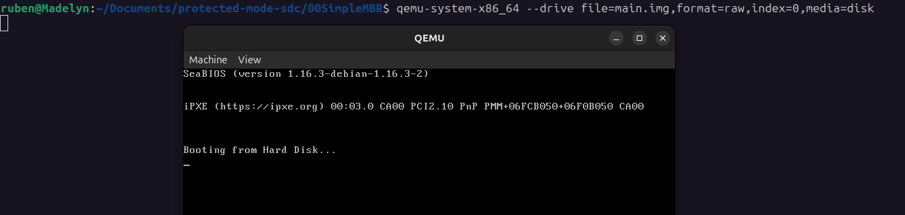

Luego se intentó grabar un pendrive con la imagen en cuestión:

```bash
sudo dd if=main.img of=/dev/sdX
```

Sin embargo, hubo dificultades para ejecutar el programa en el computador, ya que no detectaba la unidad USB como booteable.

#### UEFI

La Interfaz de Firmware Extensible Unificada​ o UEFI es una especificación que define una interfaz entre el sistema operativo y el firmware. UEFI reemplaza la antigua interfaz del Sistema Básico de Entrada y Salida (BIOS) estándar presentado en los PC IBM, sin embargo, UEFI requiere un modo de emulación de BIOS por razones de compatibilidad.

La UEFI puede proporcionar menús gráficos adicionales e incluso proporcionar acceso remoto para la solución de problemas o mantenimiento.

##### Cómo Utilizarlo

Las placas base UEFI de última generación vienen con UEFI Interactive Shell. Este es un programa de shell simple (como bash) responsable de iniciar el sistema operativo. También se puede utilizar el shell interactivo de UEFI para ejecutar scripts y comandos de shell de EFI.

El siguiente artículo muestra cómo acceder al shell interactivo UEFI en placas base UEFI y usar algunos de los comandos comunes de EFI en el shell interactivo UEFI: https://es.linux-console.net/?p=15881

##### Vulnerabilidades

El firmware UEFI generalmente es desarrollado por compañías independientes especializados en firmware, que luego es distribuido a los proveedores de hardware, ODMs, etc. Esto, sumado a que los desarrolladores suelen confiar en componentes de código abierto, genera oportunidades para que se introduzcan vulnerabilidades durante el proceso de desarrollo.

Hay tres metodos comunes en los que las vulnerabilidades pueden ser introducidas, ya sea accidentalmente o con propósitos maliciosos.

- Implantes en la cadena de fabricacion (sabotajes)
- Bugs en el codigo fuente
- Mala configuracion durante la fabricacion:
  - El proveedor deja encendido el modo Debug
  - El flash se deja desbloqueado
  - Se dejan test keys en el firmware

#### CSME e Intel MEBx

El Converged Security and Management Engine o CSME es un subsistema embebido y un dispositivo PCIe que implementa un entorno informático aislado del software principal del host que ejecuta la CPU, como el BIOS, el SO y las aplicaciones; lo que le permite detectar vulnerabilidades.

El Intel Management Engine BIOS Extension (Intel MEBx) es un recurso aislado y protegido que ofrece la habilidad de cambiar o recolectar la configuración del hardware del sistema.

#### Coreboot

Coreboot es una BIOS libre y ligera diseñado para realizar solamente el mínimo de tareas necesarias para cargar y correr un sistema operativo moderno de 32 bits o de 64 bits.

Hoy en dia es incorporado por las computadoras ThinkPad, Chromebook, Purism, System76, etc.

Su ventaja no reside en una necesidad tecnológica, sino en una ética, ya que para los desarrolladores de este proyecto es importante que todo el software del PC sea libre, y el BIOS ha sido el único que ha quedado olvidado. Los autores esperan que en los próximos años algunos fabricantes estén dispuestos a distribuirlo en sus máquinas, debido a su carácter gratuito.

---

### Linker

Un enlazador (linker) es una herramienta esencial en el proceso de compilación de un programa. Permite combinar varios modulos objeto en un solo archivo ejecutable que puede correr en un sistema.

La tarea del enlazador es manejar y conectar diferentes piezas de codigo y datos, asegurando que todas las referencias entre los mismos sean resueltas apropiadamente.

#### Linker Script

Un script de enlazador es un archivo de texto que contiene instrucciones para el enlazador sobre cómo debe organizar y combinar los modulos objeto. Define la estructura del archivo ejecutable final, incluyendo la ubicacion de las secciones de codigo y datos, y como deben ser alineadas en memoria.

El linker Script a utilizar en este trabajo es el siguiente:

```linkerscript
SECTIONS
{
    . = 0x7c00;
    .text :
    {
        __start = .;
        *(.text)
        . = 0x1FE;
        SHORT(0xAA55)
    }
}
```

> [!NOTE]
> Se quitaron los comentarios para que el script sea más legible.

##### Explicación del script

La dirección `0x7c00` es la dirección de carga del bootloader en la memoria. El bootloader se carga en esta dirección por el BIOS al iniciar el sistema. Esto es importante porque el bootloader debe saber dónde se encuentra en memoria para poder ejecutar correctamente el código.

La directiva `__start` define una etiqueta que representa la dirección de inicio de la sección `.text`. Esta etiqueta puede ser utilizada en el código para referirse a la dirección de inicio de la sección.

La sección `.text` contiene el código ejecutable del bootloader. La directiva `*` indica que se deben incluir todas las secciones de código de los modulos objeto.

La directiva `0x1FE` indica la dirección de la tabla de particiones en el disco. Esta dirección es importante porque el bootloader debe leer la tabla de particiones para poder cargar el sistema operativo.

La directiva `SHORT(0xAA55)` indica que se debe escribir el valor `0xAA55` en la dirección `0x1FE`. Este valor es la firma del bootloader y es utilizado por el BIOS para identificar un sector de arranque válido. Si el bootloader no contiene esta firma, el BIOS no podrá cargarlo y el sistema no podrá arrancar.

#### Comparativa entre la salida de objdump y hd

Utilizando el siguiente codigo en Assembly (`01HelloWodl/main.S`):

```Assembly
.code16
    mov $msg, %si
    mov $0x0e, %ah
loop:
    lodsb
    or %al, %al
    jz halt
    int $0x10
    jmp loop
halt:
    hlt
msg:
    .asciz "hello world"
```

El programa en ensamblador realiza una simple tarea: imprime el mensaje "hello world" en la pantalla utilizando la interrupción de BIOS `0x10`. La directiva `.code16` al inicio del código indica que el programa debe ejecutarse en modo real de 16 bits, que es el modo utilizado por el BIOS para interactuar con el hardware.

##### Compilación y enlazado

Para compilar, enlazar y ejecutar el programa, se utilizan los siguientes comandos:

```bash
as -g -o main.o main.S
ld --oformat binary -o main.img -T link.ld main.o
qemu-system-x86_64 -hda main.img
```

La opción `-g` en el comando `as` genera información de depuración, que puede ser útil para el análisis posterior. La opción `--oformat binary` en el comando `ld` indica que se debe generar un archivo binario plano, que es el formato esperado por QEMU.

La opción `-T` en el comando `ld` especifica el script de enlazador a utilizar. En este caso, se utiliza el script `link.ld`, que define la estructura del archivo ejecutable.

La opción `-hda` en el comando `qemu-system-x86_64` especifica el archivo de imagen a utilizar como disco duro virtual. En este caso, se utiliza el archivo `main.img`, que contiene el bootloader.

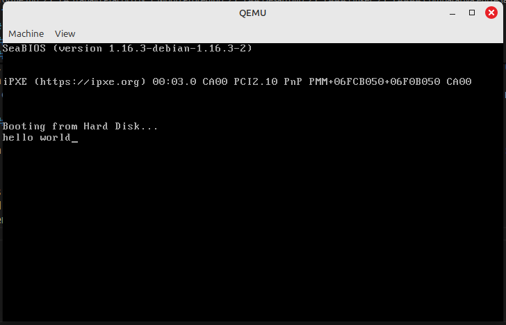

##### Salida de `objdump`

Muestra el desensamblado del archivo main.img interpretándolo como código i8086 desde el offset 0. Identifica las instrucciones iniciales (`mov`, `lods`, `int`, `hlt`). Luego objdump continúa desensamblando más allá de `hlt` (offset `0xe`), tratando los siguientes bytes como código.

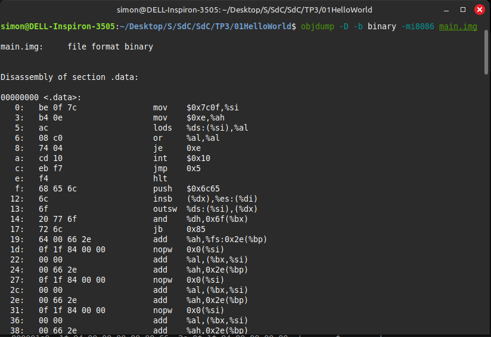

##### Salida de `hd`

Muestra los bytes crudos del archivo desde el offset `0`. Confirma la secuencia de bytes vista por `objdump` (`be 0f 7c...`). Crucialmente, su vista ASCII revela la cadena `"hello world"` exactamente en los bytes que siguen a la instrucción `hlt`.

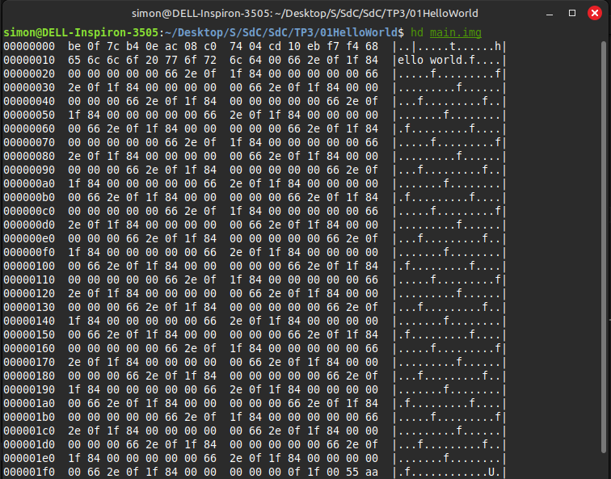

> [!NOTE]
> Ambas salidas se encuentran completas sus en respectivos archivos de texto. La salida de `objdump` se encuentra en `Archivos/objdump.txt` y la salida de `hd` se encuentra en `Archivos/hexdump.txt`.

La coincidencia de bytes entre ambas herramientas y la revelación de la cadena de texto por `hd` confirman que el programa **(código + datos)** está colocado al inicio del archivo `main.img` (offset `0`). Ambas salidas muestran que el archivo tiene `512 bytes` y termina con la firma de arranque `55 aa`.

#### Debuggeando con GDB y QEMU

Para depurar el programa, se utiliza GDB junto con QEMU. Esto permite inspeccionar el estado del programa en ejecución, incluyendo los registros y la memoria.

```bash
qemu-system-i386 -drive format=raw,file=./Archivos/01HelloWorld/main.img -boot a -s -S -monitor stdio
```

Pasos seguidos:

1. Se inicia QEMU en una terminal utilizando el codigo anterior.
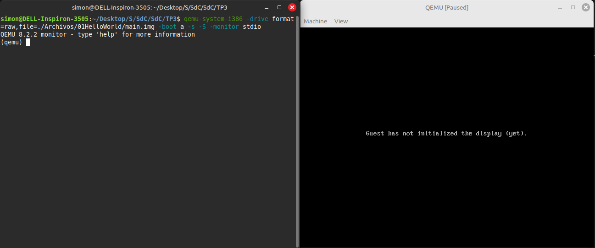
2. Se abre otra terminal y se inicia GDB.
3. Se le indica a GDB que se conecte al servidor de depuración de QEMU utilizando el comando `target remote localhost:1234`.
4. Se configura el entorno de depuración utilizando el comando `set architecture i8086`.
5. Se set el punto de interrupción en la dirección de inicio del programa utilizando el comando `b *0x7c00`.
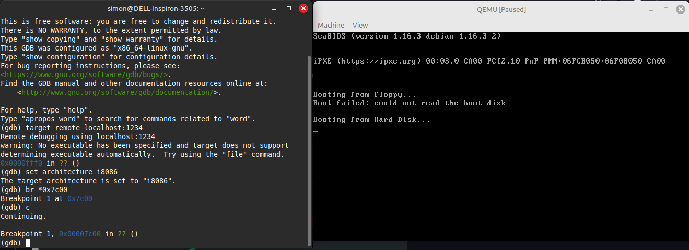
6. Se inicia la ejecución del programa utilizando el comando `c`.
7. Una vez alcanzado el breakpoint, se observan las siguientes 10 instrucciones utilizando el comando `x/10i $eip`. Y se setea el segundo breakpoint en la dirección de la instrucción siguiente a la interrupción (`jmp 0x7c05` en `0x7c0c`).
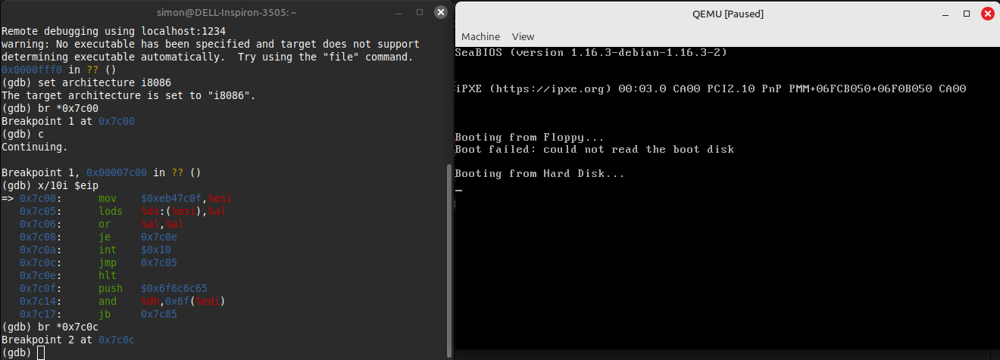
8. Se continúa la ejecución del programa utilizando el comando `c`.
9. Se observa que el programa se detiene luego de escribir una letra en la pantalla. Esto se debe a que la instrucción `int 0x10` es una llamada a la interrupción de BIOS que imprime el carácter en el registro `al` en la pantalla.
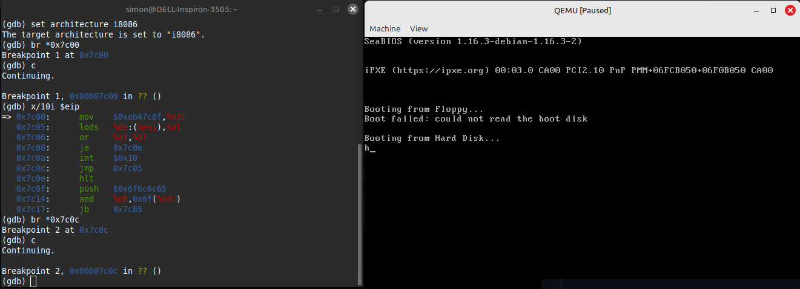
10. Si repetimos varias veces el paso 7, se puede observar que el programa sigue ejecutándose y escribiendo letras en la pantalla.
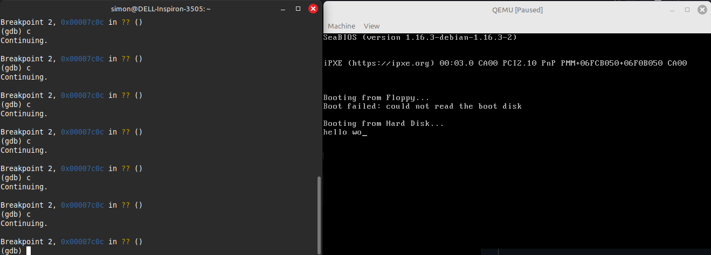
11. Repetimos el paso 7 hasta completar la cadena de texto "hello world". Hasta que ya que no hay más caracteres para imprimir.
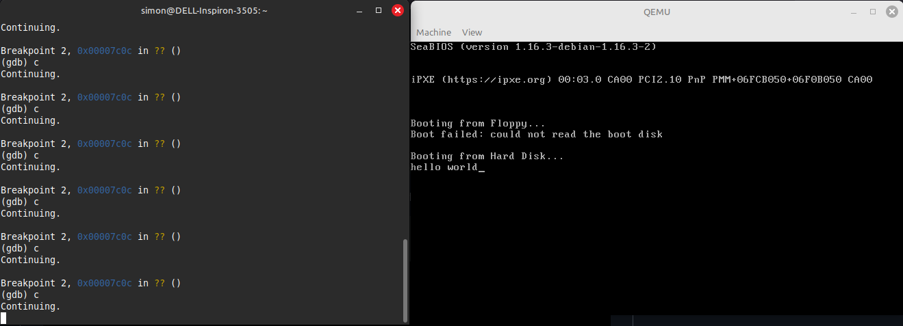

---

### Modo Protegido

#### a. Dos descriptores de memoria diferentes (uno para código y otro para datos)

En modo protegido usamos una GDT (Global Descriptor Table), que es una estructura de memoria donde definimos descriptores. Cada descriptor tiene:

- **Base:** dirección inicial del segmento.
- **Límite:** tamaño del segmento.
- **Bits de acceso:** permisos y tipo (código, datos, etc).

Entonces:

- **Descriptor de código:** por ejemplo, base `0x00000000`, límite `0x000FFFFF`, permisos de ejecución y lectura.
- **Descriptor de datos:** base distinta, por ejemplo `0x00100000`, límite `0x000FFFFF`, permisos de lectura solamente.

Así estás separando el código y los datos en distintas zonas de memoria, y protegiendo los datos contra escritura.

#### b. ¿Qué pasa si el segmento de datos es solo lectura y se intenta escribir?

En modo protegido, si intentás escribir en un segmento de solo lectura, el procesador detecta una violación de protección de memoria y lanza una excepción de falla de segmento (General Protection Fault - #GP).

Esto es una de las ventajas del modo protegido: permite prevenir errores graves o comportamientos inesperados

##### Verificacion en codigo

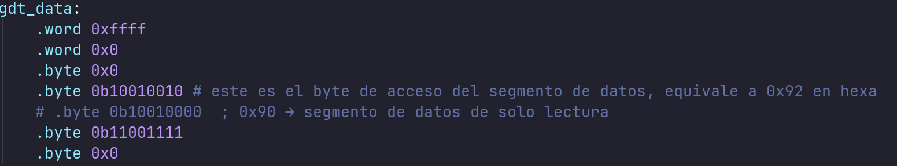

Cambios a hacer:

Cambio el byte de acceso de `gdt_data` de `0x92` a `0x90` (esto lo vuelve read-only).

- `0b10010010` = `0x92` = `1001 0010` (presente, ring 0, data segment, writable)
- `0b10010000` = `0x90` = `1001 0000` (presente, ring 0, data segment, not writable)

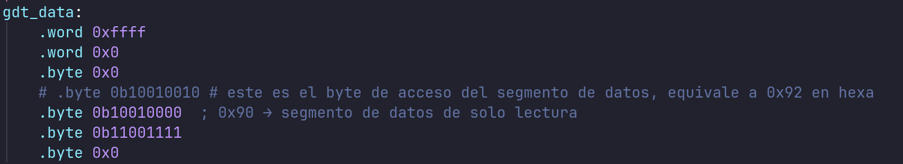

Luego intento hacer una escritura y el CPU lanza una excepción #GP (General Protection Fault).

#### c. ¿Con qué valor se cargan los registros de segmento (CS, DS, etc) en modo protegido?

No se cargan directamente con direcciones, sino con selectores. Un selector es un valor que indica:

- El índice del descriptor en la GDT
- El nivel de privilegio (CPL)
- Si es GDT o LDT
  
Por ejemplo, si el descriptor de código está en la posición 1 de la GDT:

- El selector será 0x08 (1 << 3)
- Se carga con: mov ax, 0x08 ; mov ds, ax

Entonces:
- Los registros de segmento se cargan con selectores que apuntan a los descriptores definidos en la GDT.
- Esto permite que el procesador interprete correctamente desde qué base leer la memoria, qué permisos hay, etc.

##### Verificacion en Codigo

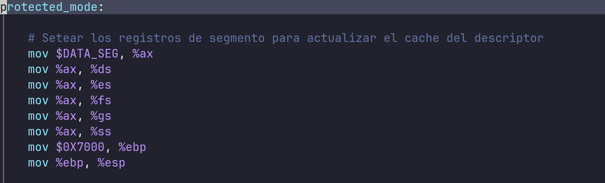

Esto carga `ds`, `es`, etc. con el selector del segmento de datos.

En modo protegido, los registros de segmento son selectores, que contienen:

- índice dentro de la GDT
- bits de privilegio (RPL)
- bit TI (tabla usada: GDT o LDT)

Se hace esto para que el CPU lea el descriptor desde la GDT y actualice los registros ocultos (base, límite, atributos), que son necesarios para acceder correctamente a memoria.

## Conclusiones

El trabajo práctico nos permitió comprender el funcionamiento del modo protegido de la arquitectura x86, así como también el funcionamiento del bootloader y el proceso de arranque de un sistema operativo. Aprendimos a utilizar herramientas como QEMU y GDB para depurar programas en modo real y protegido, y a utilizar un enlazador para crear archivos ejecutables.