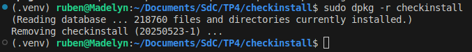
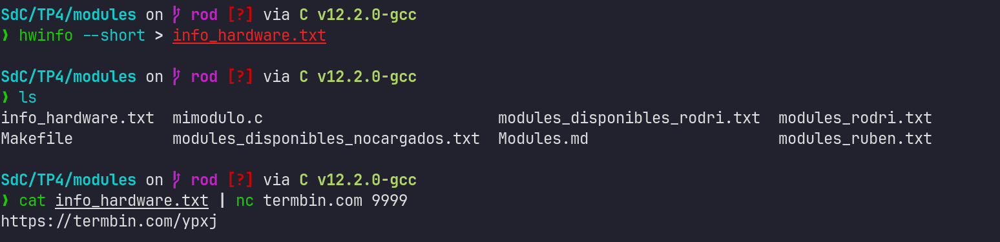
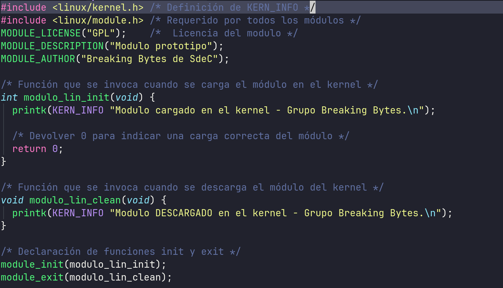
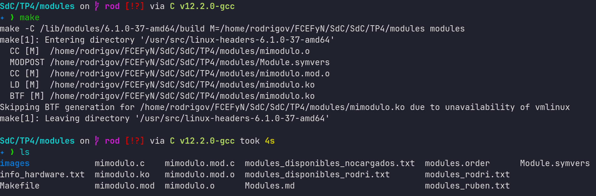
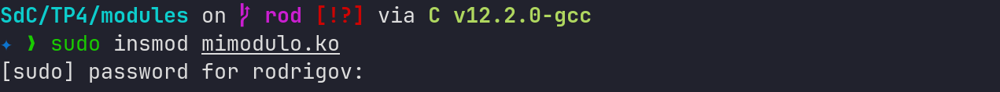
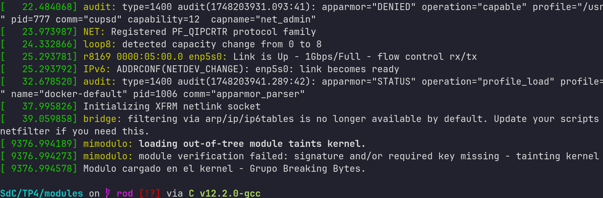
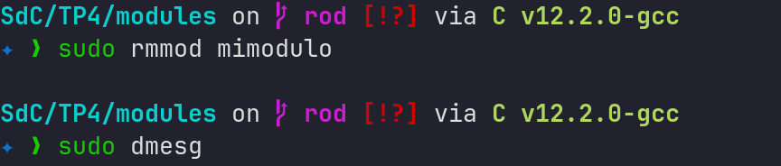

# Trabajo Práctico N°4: Modulos de Kernel

### `Breaking Bytes`

- SAILLEN, Simón.
- VARGAS, Rodrigo Sebastian.
- ZÚÑIGA, Guillermo Rubén Darío.

## Introducción

>[!NOTE]
> COMPLETAR

## Desarrollo

### Desafio N°1

#### Checkinstall

CheckInstall es un programa para Unix que permite la instalación y desinstalación de software compilado desde el código fuente para ser administrado por un Sistema de gestión de paquetes. Después de la compilación del paquete, este puede generar paquetes compartibles para Slackware, RPM o Debian.

Los beneficios principales de CheckInstall contra simplemente ejecutar make install es la habilidad de desinstalar el paquete del sistema usando su Sistema de gestión de paquetes, además de poder instalar el paquete resultante en varias computadoras.

#### Instalación de un paquete

En la carpeta `TP4/checkinstall` se empaquetó un archivo en C que imprime "hello world" mediante el comando `sudo checkinstall`. Para ello se requirió un Makefile.

```makefile
CC = gcc
CFLAGS = -Wall

all: hello

hello: hello_world.c
	$(CC) $(CFLAGS) -o hello_world hello_world.c

install: hello
	cp hello_world /usr/local/bin/

clean:
	rm -f hello_world
```


Posteriormente se realizó la desinstalación del paquete.



#### ¿Cómo mejorar la seguridad del kernel?

El concepto de Arranque Seguro requiere de la existencia de una cadena de confianza, desde el codigo de firmware hasta los modulos de kernel. De aquí surge la idea de la firma de los modulos de kernel para certificar su fiabilidad, por lo que la cuestión es plantear mejoras en el proceso de verificación de estas firmas y así evitar cargar modulos que no esten firmados.

Existen los llamados `rootkits`, que consisten en un conjunto de programas generalmente maliciosos, diseñados para actuar en una computadora con maximo privilegio e impedir que ningun otro software lo detecte.

Este y otros programas parecidos pueden evitarse mediante varias acciones:

- Mantener activado el Secure Boot
- Configurar la politica de carga de submodulos
- Implementar herramientas de monitoreo en tiempo real
- Mantener actualizado el kernel y los modulos
- Usar sistemas de control de acceso como SELinux o AppArmor
- Deshabilitar la carga de modulos en entornos criticos
- Mantener deshabilitados los modulos que no sean de utilidad

---

### Desafio N°2

#### ¿Cómo empiezan y terminan unos y otros?

Un **programa** comienza con una función `main()`, se ejecuta hasta la última línea de código y retorna el control al sistema operativo o a quien los convocó.

Por otro lado un **módulo** no tienen `main()`, en su lugar, tienen funciones de "entrada" (`module_init()`) que se ejecutan cuando el módulo se carga, y funciones de "salida" (`module_exit()`) que se ejecutan cuando se descarga, para registrar o desregistrar la funcionalidad que proporcionan.

#### ¿Qué funciones tiene disponible un programa y un módulo?

La principal diferencia en las funciones y capacidades disponibles entre un programa de usuario y un módulo del kernel radica en el nivel de privilegio y el espacio de memoria en el que operan.

##### Programa de usuario (User Space)

Un programa de usuario opera en el espacio de usuario (user space), que es un entorno restringido y aislado para la seguridad y estabilidad del sistema.

Algunas características y funciones disponibles para un programa de usuario incluyen:
- **Acceso a bibliotecas de usuario**: Los programas de usuario pueden utilizar bibliotecas estándar como libc para realizar operaciones comunes, como entrada/salida, manejo de cadenas, etc.
- **Interacción con el sistema operativo**: Pueden realizar llamadas al sistema (syscalls) para interactuar con el kernel, como abrir archivos, crear procesos, asignar memoria, etc.
- **Interfaz de usuario**: Pueden interactuar con el usuario a través de la terminal o interfaces gráficas, utilizando funciones de bibliotecas como `printf`, `scanf`, etc.
- **Seguridad y aislamiento**: Los programas de usuario están aislados entre sí y del kernel, lo que significa que no pueden acceder directamente a la memoria de otros procesos o al kernel.
- **Gestión de memoria virtual**: Cada programa de usuario tiene su propio espacio de direcciones virtuales, lo que proporciona aislamiento y protección de memoria entre procesos.
- **Manejo de señales**: Los programas de usuario pueden recibir y manejar señales del sistema.
- **Comunicación entre procesos (IPC)**: Pueden utilizar mecanismos como tuberías, colas de mensajes, semáforos y memoria compartida para comunicarse con otros procesos.

##### Módulo del kernel (Kernel Space)

Un módulo del kernel opera en el espacio del kernel (kernel space), un entorno privilegiado donde reside el núcleo del sistema operativo.

Algunas características y funciones disponibles para un módulo del kernel incluyen:

- **Acceso directo a hardware**: Los módulos del kernel pueden interactuar directamente con el hardware, lo que les permite controlar dispositivos y realizar operaciones de bajo nivel.
- **Acceso a estructuras de datos del kernel**: Pueden acceder y modificar estructuras de datos internas del kernel, como tablas de procesos, listas de dispositivos, etc.
- **No utilizan bibliotecas de usuario**: Los módulos del kernel no pueden usar funciones de la biblioteca estándar de C como `printf` o `malloc` de la misma manera que los programas de usuario. En su lugar, utilizan funciones equivalentes proporcionadas por el propio kernel (ej. `printk` para mensajes, `kmalloc` para asignación de memoria).
- **Manejo de interrupciones**: Pueden registrar controladores de interrupciones para manejar eventos de hardware.
- **Manejo de procesos y tareas**: Pueden crear y gestionar procesos y tareas dentro del kernel.
- **Exportar simbolos**: Pueden exportar funciones y variables para que otros módulos del kernel puedan utilizarlas.

#### Espacio de Usuario vs Espacio del Kernel

|| Espacio de Usuario | Espacio del Kernel |
|---|---------------------|--------------------|
| **Acceso a hardware** | No tiene acceso directo al hardware, utiliza llamadas al sistema para interactuar con el kernel. | Tiene acceso directo al hardware y puede interactuar con él sin restricciones. |
| **Seguridad** | Aislado del kernel, lo que proporciona seguridad y estabilidad al sistema. | Tiene acceso completo al sistema, lo que puede ser riesgoso si se comete un error. |
| **Memoria** | Cada proceso tiene su propio espacio de direcciones virtuales, lo que proporciona aislamiento entre procesos. | Comparte el mismo espacio de direcciones, lo que permite una comunicación más eficiente pero con mayor riesgo de corrupción de memoria. |
| **Funciones disponibles** | Utiliza bibliotecas de usuario y syscalls para realizar operaciones. | Utiliza funciones del kernel para realizar operaciones, como `printk`, `kmalloc`, etc. |

#### Espacio de Datos (Data Segment) y Espacio de Nombres (namespace)

|| Espacio de Datos (Data Segment) | Espacio de Nombres (namespace) |
|---|------------------|--------------------|
| **Concepto Principal** | Región de la memoria virtual de un proceso. | Mecanismo de aislamiento a nivel de kernel. |
| **Contenido** | Contiene variables globales y estáticas, así como datos inicializados y no inicializados. | Agrupa recursos del sistema (procesos, archivos, redes) para proporcionar un entorno aislado. |
| **Propósito** | Almacenar datos persistentes durante la ejecución del programa. | Aislar recursos entre diferentes procesos o grupos de procesos. |
| **Ambito** | Específico de cada proceso, no compartido entre ellos. | Puede ser compartido entre procesos que pertenecen al mismo espacio de nombres. |
| **Gestión** | Gestionado por el sistema operativo y el compilador, asignando memoria al inicio del programa. | Gestionado por el kernel a través de syscalls específicas como `clone()`, `unshare()`, `setns()`. |
| **Visibilidad** | Las variables en el espacio de datos son visibles para el proceso que las define. | Los recursos en un espacio de nombres son visibles solo para los procesos que pertenecen a ese espacio de nombres. |
| **Impacto en el sistema** | No afecta a otros procesos, ya que cada uno tiene su propio espacio de datos. | Un error en la configuración o uso de un espacio de nombres puede afectar el aislamiento, la seguridad o el funcionamiento de los procesos dentro de él. |

#### Drivers y contenido de `/dev`

Los **drivers** son programas que permiten al sistema operativo interactuar con el hardware. En Linux, los drivers pueden ser módulos del kernel o parte del núcleo mismo. Los dispositivos gestionados por estos drivers se representan en el sistema de archivos `/dev`, donde cada dispositivo tiene un archivo especial asociado.

El directorio `/dev` en Linux es un sistema de archivos virtual que contiene nodos de dispositivo. Estos nodos actúan como interfaces de archivo que los programas de usuario emplean para interactuar con el hardware y los pseudodispositivos gestionados por el kernel. 

Se dividen en:

- **Dispositivos de Bloque**: Para acceso estructurado (ej., discos duros como `/dev/sda`).
- **Dispositivos de Carácter**: Para flujos de datos (ej., terminales como `/dev/tty`).
- **Pseudodispositivos**: Funcionalidades del kernel sin hardware físico (ej., `/dev/null` para descartar datos).

#### Ejemplo de `strace`

Programa en C que utiliza `printf()`:

```C
#include <stdio.h>

int main()
{
    printf("Hello, World!\n");
}
```

```bash
gcc -o printf.c printf -Wall
strace -tt printf
strace -c printf
```

```console
simon@DELL-Inspiron-3505:~/Desktop/S/SdC/SdC/TP4/desafio_2$ strace -tt printf
22:32:30.527832 execve("/usr/bin/printf", ["printf"], 0x7fffa077af48 /* 76 vars */) = 0
22:32:30.530917 brk(NULL)               = 0x63cc26f1e000
22:32:30.531090 mmap(NULL, 8192, PROT_READ|PROT_WRITE, MAP_PRIVATE|MAP_ANONYMOUS, -1, 0) = 0x7790775a4000
22:32:30.531453 access("/etc/ld.so.preload", R_OK) = -1 ENOENT (No such file or directory)
22:32:30.531804 openat(AT_FDCWD, "/etc/ld.so.cache", O_RDONLY|O_CLOEXEC) = 3
22:32:30.532015 fstat(3, {st_mode=S_IFREG|0644, st_size=82407, ...}) = 0
22:32:30.532134 mmap(NULL, 82407, PROT_READ, MAP_PRIVATE, 3, 0) = 0x77907758f000
22:32:30.532290 close(3)                = 0
22:32:30.532407 openat(AT_FDCWD, "/lib/x86_64-linux-gnu/libc.so.6", O_RDONLY|O_CLOEXEC) = 3
22:32:30.532533 read(3, "\177ELF\2\1\1\3\0\0\0\0\0\0\0\0\3\0>\0\1\0\0\0\220\243\2\0\0\0\0\0"..., 832) = 832
22:32:30.532687 pread64(3, "\6\0\0\0\4\0\0\0@\0\0\0\0\0\0\0@\0\0\0\0\0\0\0@\0\0\0\0\0\0\0"..., 784, 64) = 784
22:32:30.532833 fstat(3, {st_mode=S_IFREG|0755, st_size=2125328, ...}) = 0
22:32:30.532972 pread64(3, "\6\0\0\0\4\0\0\0@\0\0\0\0\0\0\0@\0\0\0\0\0\0\0@\0\0\0\0\0\0\0"..., 784, 64) = 784
22:32:30.533115 mmap(NULL, 2170256, PROT_READ, MAP_PRIVATE|MAP_DENYWRITE, 3, 0) = 0x779077200000
22:32:30.533276 mmap(0x779077228000, 1605632, PROT_READ|PROT_EXEC, MAP_PRIVATE|MAP_FIXED|MAP_DENYWRITE, 3, 0x28000) = 0x779077228000
22:32:30.533483 mmap(0x7790773b0000, 323584, PROT_READ, MAP_PRIVATE|MAP_FIXED|MAP_DENYWRITE, 3, 0x1b0000) = 0x7790773b0000
22:32:30.533628 mmap(0x7790773ff000, 24576, PROT_READ|PROT_WRITE, MAP_PRIVATE|MAP_FIXED|MAP_DENYWRITE, 3, 0x1fe000) = 0x7790773ff000
22:32:30.533814 mmap(0x779077405000, 52624, PROT_READ|PROT_WRITE, MAP_PRIVATE|MAP_FIXED|MAP_ANONYMOUS, -1, 0) = 0x779077405000
22:32:30.533973 close(3)                = 0
22:32:30.534106 mmap(NULL, 12288, PROT_READ|PROT_WRITE, MAP_PRIVATE|MAP_ANONYMOUS, -1, 0) = 0x77907758c000
22:32:30.534239 arch_prctl(ARCH_SET_FS, 0x77907758c740) = 0
22:32:30.534350 set_tid_address(0x77907758ca10) = 11940
22:32:30.534436 set_robust_list(0x77907758ca20, 24) = 0
22:32:30.534526 rseq(0x77907758d060, 0x20, 0, 0x53053053) = 0
22:32:30.534704 mprotect(0x7790773ff000, 16384, PROT_READ) = 0
22:32:30.534827 mprotect(0x63cc20978000, 4096, PROT_READ) = 0
22:32:30.534902 mprotect(0x7790775e2000, 8192, PROT_READ) = 0
22:32:30.535000 prlimit64(0, RLIMIT_STACK, NULL, {rlim_cur=8192*1024, rlim_max=RLIM64_INFINITY}) = 0
22:32:30.535136 munmap(0x77907758f000, 82407) = 0
22:32:30.535282 getrandom("\x6c\x16\xc5\x91\x3f\x28\x09\x9b", 8, GRND_NONBLOCK) = 8
22:32:30.535391 brk(NULL)               = 0x63cc26f1e000
22:32:30.535482 brk(0x63cc26f3f000)     = 0x63cc26f3f000
22:32:30.535577 openat(AT_FDCWD, "/usr/lib/locale/locale-archive", O_RDONLY|O_CLOEXEC) = 3
22:32:30.535724 fstat(3, {st_mode=S_IFREG|0644, st_size=8398816, ...}) = 0
22:32:30.535829 mmap(NULL, 8398816, PROT_READ, MAP_PRIVATE, 3, 0) = 0x779076800000
22:32:30.535992 close(3)                = 0
22:32:30.536283 openat(AT_FDCWD, "/usr/share/locale/locale.alias", O_RDONLY|O_CLOEXEC) = 3
22:32:30.536447 fstat(3, {st_mode=S_IFREG|0644, st_size=2996, ...}) = 0
22:32:30.536585 read(3, "# Locale name alias data base.\n#"..., 4096) = 2996
22:32:30.536729 read(3, "", 4096)       = 0
22:32:30.536820 close(3)                = 0
22:32:30.536911 openat(AT_FDCWD, "/usr/share/locale/en_US/LC_MESSAGES/coreutils.mo", O_RDONLY) = -1 ENOENT (No such file or directory)
22:32:30.537021 openat(AT_FDCWD, "/usr/share/locale/en/LC_MESSAGES/coreutils.mo", O_RDONLY) = -1 ENOENT (No such file or directory)
22:32:30.537126 openat(AT_FDCWD, "/usr/share/locale-langpack/en_US/LC_MESSAGES/coreutils.mo", O_RDONLY) = -1 ENOENT (No such file or directory)
22:32:30.537516 openat(AT_FDCWD, "/usr/share/locale-langpack/en/LC_MESSAGES/coreutils.mo", O_RDONLY) = 3
22:32:30.537762 fstat(3, {st_mode=S_IFREG|0644, st_size=613, ...}) = 0
22:32:30.537851 mmap(NULL, 613, PROT_READ, MAP_PRIVATE, 3, 0) = 0x7790775a3000
22:32:30.537956 close(3)                = 0
22:32:30.538061 write(2, "printf: ", 8printf: ) = 8
22:32:30.538147 write(2, "missing operand", 15missing operand) = 15
22:32:30.538225 write(2, "\n", 1
)       = 1
22:32:30.538310 write(2, "Try 'printf --help' for more inf"..., 42Try 'printf --help' for more information.
) = 42
22:32:30.538391 close(1)                = 0
22:32:30.538458 close(2)                = 0
22:32:30.538549 exit_group(1)           = ?
22:32:30.539101 +++ exited with 1 +++
[ble: exit 1]
```

```console
simon@DELL-Inspiron-3505:~/Desktop/S/SdC/SdC/TP4/desafio_2$ strace -c printf
printf: missing operand
Try 'printf --help' for more information.
% time     seconds  usecs/call     calls    errors syscall
------ ----------- ----------- --------- --------- ----------------
 52,60    0,000970         970         1           execve
 11,93    0,000220          22        10           mmap
 11,12    0,000205          25         8         3 openat
  4,56    0,000084          21         4           write
  4,23    0,000078          11         7           close
  3,15    0,000058          11         5           fstat
  2,82    0,000052          17         3           mprotect
  2,33    0,000043          14         3           read
  1,63    0,000030          10         3           brk
  1,57    0,000029          29         1           munmap
  1,25    0,000023          23         1         1 access
  0,65    0,000012           6         2           pread64
  0,49    0,000009           9         1           getrandom
  0,38    0,000007           7         1           arch_prctl
  0,38    0,000007           7         1           prlimit64
  0,33    0,000006           6         1           set_tid_address
  0,33    0,000006           6         1           rseq
  0,27    0,000005           5         1           set_robust_list
------ ----------- ----------- --------- --------- ----------------
100,00    0,001844          34        54         4 total
```

Ambas salidas de `strace` revelan que incluso un programa simple como `printf` requiere una intensa interacción con el kernel de Linux. El `strace -tt` muestra una cronología detallada de llamadas al sistema (*syscalls*) para tareas como la carga y ejecución del programa (*execve*), la gestión de memoria (`mmap`, `brk`), la apertura y lectura de archivos esenciales (como la biblioteca estándar de C, libc.so.6, y archivos de localización), y la escritura de la salida en pantalla (*write*). Esto demuestra que el sistema operativo orquesta minuciosamente cada paso del proceso, desde la inicialización hasta la finalización.

Por otro lado, el `strace -c` cuantifica estas interacciones, destacando que la inicialización y la carga de recursos son las operaciones más costosas en términos de tiempo y cantidad de syscalls. execve, mmap y openat dominan las estadísticas, lo que subraya el significativo trabajo del kernel para establecer el entorno de ejecución de un programa, incluyendo la carga de bibliotecas compartidas que proporcionan la funcionalidad de alto nivel. En esencia, strace ilustra cómo los programas de usuario dependen fundamentalmente del kernel para realizar hasta las tareas más básicas.

---

### Desafio N°3

#### Firma del modulo `mimodulo`

Para colocar una firma al modulo `mimodulo.ko`, primero se creo un certificado X509 en Shim mediante un archivo de configuración.

```cnf
# certificate.cnf

# This definition stops the following lines choking if HOME isn't
# defined.
HOME                    = .
RANDFILE                = $ENV::HOME/.rnd 
[ req ]
distinguished_name      = req_distinguished_name    # Subject fields (DN)
x509_extensions         = v1                        # Extensions defined in section [v1]
string_mask             = utf8only                  # Force UTF-8 in DN
prompt                  = no                        # Don't ask to introduce DN values

# Optional section. You can also remove it along with the
# "distinguished_name" and "prompt" fields above.
[ req_distinguished_name ]
countryName             = AR
stateOrProvinceName     = Cordoba
localityName            = Cordoba
0.organizationName      = Universidad Nacional de Cordoba
commonName              = Secure Boot Signing
emailAddress            = ruben.zuniga@mi.unc.edu.ar

[ v1 ]
subjectKeyIdentifier    = hash                  # Subject identificator (based on pubkey hash)
authorityKeyIdentifier  = keyid:always,issuer   # Always include keyid and issuer that signed the certificate
basicConstraints        = critical,CA:FALSE     # Requires a strict validation and it's not a Certificate Authority
extendedKeyUsage        = codeSigning,1.3.6.1.4.1.311.10.3.6,1.3.6.1.4.1.2312.16.1.2    # Used to sign modules, Microsoft EKU, Linux kernel EKU (Extended Key Usage)
nsComment               = "OpenSSL Generated Certificate"
```

Luego, se crearon las llaves privadas y publicas.


Para realizar la firma se necesitan ambas, y para "enrollar" la llave en shim se utiliza la publica (MOK.der):


Luego se reinició la maquina y se mostró la pantalla de MokManager antes de la carga de GRUB. Aqui es donde se enrollo la llave.


Finalmente se firmó el modulo de kernel `mimodulo.ko`. A continuacion se muestra la ejecucion del comando `insmod` antes y despues de realizar la firma, todo esto con Secure Boot habilitado.


Se puede verificar si un módulo esta firmado observando que a la salida de `hexdump` se incluya el string "Module signature appended".


### Preguntas Adicionales

#### 1. ¿Qué diferencias se pueden observar entre los dos modinfo?

Al comparar la salida de modinfo para un módulo personalizado (mimodulo.ko) con la de un módulo del sistema (/lib/modules/$(uname -r)/kernel/crypto/des_generic.ko), se observan varias diferencias importantes:

##### Ubicación y propósito:

mimodulo.ko es un módulo creado por el usuario, compilado manualmente, y aún no está instalado en el árbol del kernel.

des_generic.ko es un módulo oficial del kernel, ubicado dentro de la jerarquía /lib/modules/, y forma parte del sistema operativo.

##### Firma digital (signature):

des_generic.ko incluye una firma digital que permite verificar su integridad y autenticidad. Esto es importante para sistemas con Secure Boot o políticas estrictas de carga de módulos.

mimodulo.ko no tiene firma digital, lo que es común en módulos desarrollados localmente. Esto puede impedir su carga en sistemas que requieren firma, a menos que se desactive Secure Boot o se firme manualmente.

##### Alias:

des_generic.ko incluye alias que permiten que el kernel lo cargue automáticamente cuando detecta hardware o condiciones específicas asociadas.

mimodulo.ko generalmente no tiene alias definidos, a menos que se especifiquen explícitamente mediante macros como MODULE_ALIAS.

##### Metadatos adicionales:

Los módulos del sistema suelen tener más campos definidos (como srcversion, intree, retpoline, etc.) que indican si el módulo fue construido como parte del árbol oficial del kernel, si soporta mitigaciones de seguridad, entre otros.

En el módulo personalizado, estos campos pueden faltar o tener valores genéricos.

##### Compatibilidad y dependencias:

Ambos módulos incluyen campos como vermagic y depends, pero los del sistema suelen estar más alineados con la configuración actual del kernel, mientras que un módulo personalizado puede generar errores si no fue compilado con los headers correctos.

#### 2. Drivers/modulos cargados en nuestras PC's

Cada lista de modulos cargado de cada integrante va a estar en su correspondiente modules_nombre.txt, debajo se hace una comparacion entre los tres

##### Diff

>[!NOTE]
> COMPLETAR

#### 3.

##### a. ¿Cómo ver qué módulos no están cargados pero sí están disponibles?

Estos módulos existen en el sistema pero no están activos (no están cargados en el kernel). Para verlos:

###### 1) Buscar todos los módulos disponibles en tu sistema:

```bash
find /lib/modules/$(uname -r) -type f -name "*.ko*" | xargs -n1 basename | sed 's/\.ko.*$//'

```

- find ... -name "_.ko_": encuentra todos los archivos de módulo (.ko, .ko.xz, etc.).

- xargs -n1 basename: quita la ruta completa, dejando solo el nombre del archivo.

- sed 's/\.ko.\*$//': limpia la extensión (.ko, .ko.xz, etc.) para mostrar el nombre del módulo limpio, tal como aparece en lsmod.

###### 2) Ver los módulos cargados actualmente:

```bash
lsmod
```

###### 3) Dispositivos sin modulos

Podés intentar detectar dispositivos sin driver con

```bash
dmesg | grep -i firmware
```

###### 4) Comparacion de listas

En este caso la comparacion se va a hacer a partir de modules_rodri.txt

**Obtener la lista de módulos disponibles**

```bash
find /lib/modules/$(uname -r) -type f -name "*.ko*" | xargs -n1 basename | sed 's/\.ko.*$//' | sort > modules_disponibles_rodri.txt
```

**Obtener la lista de módulos cargados**

```bash
lsmod | tail -n +2 | awk '{print $1}' | sort > modules_rodri.txt
```

###### Comparar ambas listas

**Módulos disponibles pero no cargados:**

```bash
comm -23 modules_disponibles_rodri.txt modules_rodri.txt
```

**Módulos cargados pero no disponibles (esto normalmente no pasa, pero para verificar)**

```bash
comm -13 modules_disponibles_rodri.txt modules_rodri.txt
```

- comm compara dos archivos línea a línea (los archivos deben estar ordenados).
- La columna 1 de comm son líneas únicas del primer archivo.
- La columna 2 son líneas comunes.
- La columna 3 son líneas únicas del segundo archivo.

##### b. ¿Qué pasa cuando un driver (módulo) no está disponible en el sistema?

Hay dos situaciones posibles:

**No está cargado, pero sí está instalado:**

Solución simple: se puede cargar manualmente con `modprobe <nombre_modulo>`.

**No está instalado en absoluto:**

El dispositivo probablemente no funcione (por ejemplo, no tenés sonido, red, Wi-Fi, etc.).

No lo vas a ver ni en lsmod ni en `/lib/modules/`...

Soluciones:

- Buscar e instalar el paquete del driver adecuado (por ejemplo, apt install firmware-realtek).
- En casos más extremos, compilar el módulo vos mismo si es muy específico.

#### 4. Usar hwinfo y subir la info a un paste online



##### URL:

```plain
- https://termbin.com/ypxj
```

#### 5. ¿Qué diferencia existe entre un módulo y un programa ?

##### Modulo

Es una pieza de código que se puede cargar o descargar dinámicamente en el núcleo del sistema operativo (kernel) sin necesidad de reiniciar.

- Ejemplo: un controlador (driver) de hardware, como snd_hda_intel.ko para audio o e1000e.ko para una placa de red Intel.
- Se integra directamente con el kernel usando interfaces internas.

Se usa para extender las funcionalidades del kernel, por ejemplo:

- Soporte para nuevos dispositivos
- Sistemas de archivos adicionales
- Protocolo de red adicional

**Caracteristicas**

- No se ejecuta como proceso en espacio de usuario, sino en modo kernel (kernel space).
- Cualquier error puede comprometer la estabilidad del sistema.
- Se cargan con insmod, modprobe y se listan con lsmod.

##### Programa

Es una aplicación que se ejecuta en el espacio de usuario.

- Ejemplo: ls, firefox, htop, un juego, o un script de Python.
- Se comunica con el kernel a través de llamadas al sistema (syscalls).

Se utiliza para realizar tareas específicas para el usuario o sistema.

**Caracteristicas**

- Corre como un proceso aislado, protegido del resto del sistema.
- Los errores generalmente no afectan al sistema operativo.
- Se ejecutan desde la terminal o entorno gráfico

#### 6. ¿Cómo puede ver una lista de las llamadas al sistema que realiza un simple helloworld en c?

Podés ver las llamadas al sistema que realiza un programa como un hello world en C usando la herramienta strace. Esta herramienta intercepta y muestra todas las syscalls (llamadas al sistema) que realiza un proceso.

#### 7. ¿Qué es un segmentation fault? ¿Cómo lo maneja el kernel y como lo hace un programa?

Un segmentation fault (o segfault) es un error que ocurre cuando un programa intenta acceder a una región de memoria que no tiene permiso de usar, ya sea porque:

- No está asignada (por ejemplo, puntero no inicializado o NULL).
- Es de solo lectura y el programa intenta escribir.
- Está fuera del rango válido (como acceder más allá de un array).

En si, un segfault es una forma de violación de segmento: el programa viola las reglas del espacio de memoria que le fue asignado por el sistema operativo.

##### ¿Cómo lo maneja el kernel?

Cada proceso tiene un espacio de direcciones virtual definido y protegido.
Cuando el programa intenta acceder a memoria inválida, ocurre una falta de segmentación (page fault).
El kernel detecta que ese acceso no es válido.

Entonces:

- Lanza una señal SIGSEGV al proceso.
- Por defecto, el proceso se termina inmediatamente.
- En consola suele aparecer: Segmentation fault (core dumped)

##### ¿Cómo lo maneja el programa?

Un programa puede capturar la señal SIGSEGV usando funciones como signal() o sigaction() para ejecutar código antes de terminar.

- Sin embargo, no se recomienda intentar continuar la ejecución después de una SIGSEGV. Es mejor solo registrar el error y terminar de forma controlada.

##### Importancia

- Es un mecanismo de protección: impide que los programas corrompan memoria de otros procesos o del propio kernel.
- Ayuda a detectar bugs graves en el código (punteros mal usados, accesos fuera de rango, etc.).

#### 9. Agregar evidencia de la compilación, carga y descarga de su propio módulo imprimiendo el nombre del equipo en los registros del kernel.



##### Compilacion utilizando un Makefile

```Makefile
obj-m += mimodulo.o

all:
  make -C /lib/modules/$(shell uname -r)/build M=$(PWD) modules

clean:
  make -C /lib/modules/$(shell uname -r)/build M=$(PWD) clean
```

all es la regla por defecto.

Llama a make dentro del árbol de compilación del kernel actual.

- -C /lib/modules/.../build: entra al directorio con los headers y Makefiles del kernel.
- M=$(PWD): le indica que compile el módulo que está en tu directorio actual.
- modules: objetivo estándar para compilar módulos externos.

Luego con el clean limpia los archivos generados de la compilación (_.o, _.ko, etc.) usando el sistema de build del kernel.



##### Carga del modulo utilizando insmod



###### Se verifica con demsg



##### Descarga del modulo utilizando rmmod



###### Se verifica con demsg


#### 10. ¿Que pasa si mi compañero con secure boot habilitado intenta cargar un módulo firmado por mi?

Si mi compañero tiene Secure Boot habilitado y intenta cargar un módulo de kernel firmado por mi, lo más probable es que el módulo sea rechazado y no se cargue. Secure Boot está diseñado para cargar solo software de arranque con una firma digital válida y de confianza, y mi clave de firma personal no estaría incluida en la base de datos de confianza de su sistema por defecto.

Para que mi compañero pueda cargar mi módulo, tendría que deshabilitar Secure Boot o inscribir mi clave pública en la base de datos MOK (Machine Owner Key) de su sistema, lo que le permitiría reconocer mi firma como válida. Sin estos pasos, el sistema considerará mi módulo como no confiable y bloqueará su carga.

#### 11. Dada la siguiente nota 

Link: https://arstechnica.com/security/2024/08/a-patch-microsoft-spent-2-years-preparing-is-making-a-mess-for-some-linux-users/

##### a. ¿Cuál fue la consecuencia principal del parche de Microsoft sobre GRUB en sistemas con arranque dual (Linux y Windows)?

La consecuencia principal del parche de Microsoft, con un rating de gravedad de 8.6 sobre 10, hizo posible para los atacantes eludir el Secure Boot, que es el estándar de la industria para garantizar que los dispositivos que ejecutan Windows u otros sistemas operativos no carguen firmware o software malicioso durante el proceso de arranque.

##### b. ¿Qué implicancia tiene desactivar Secure Boot como solución al problema descrito en el artículo?

Desactivar Secure Boot como solución al problema descrito en el artículo implica una reducción significativa de la seguridad del sistema. Al desactivar esta característica, se permite que cualquier software, incluso aquel que no ha sido verificado o firmado digitalmente, se cargue durante el proceso de arranque. Esto abre la puerta a potenciales ataques de malware, rootkits y otros tipos de software malicioso que podrían comprometer la integridad y seguridad del sistema operativo y los datos del usuario. Por lo tanto, aunque puede ser una solución temporal para permitir el arranque dual, no es recomendable a largo plazo debido a los riesgos asociados.

##### c. ¿Cuál es el propósito principal del Secure Boot en el proceso de arranque de un sistema?

El propósito principal del Secure Boot en el proceso de arranque de un sistema es garantizar que solo se cargue software de arranque y controladores que sean confiables y estén firmados digitalmente por una entidad autorizada. Esto ayuda a prevenir la ejecución de código malicioso durante el arranque, protegiendo así el sistema contra ataques como rootkits, bootkits y otros tipos de malware que podrían comprometer la seguridad del dispositivo desde el inicio.

## Conclusión
