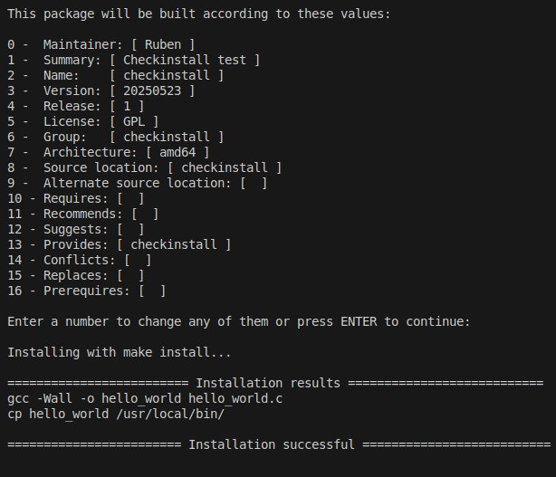
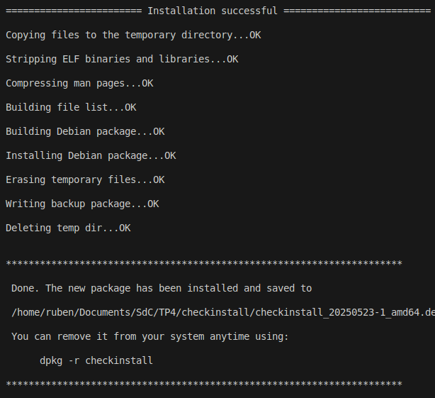
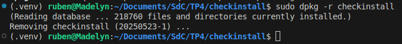

# Checkinstall

CheckInstall es un programa para Unix que permite la instalación y desinstalación de software compilado desde el código fuente para ser administrado por un Sistema de gestión de paquetes. Después de la compilación del paquete, este puede generar paquetes compartibles para Slackware, RPM o Debian.

Los beneficios principales de CheckInstall contra simplemente ejecutar make install es la habilidad de desinstalar el paquete del sistema usando su Sistema de gestión de paquetes, además de poder instalar el paquete resultante en varias computadoras.

## Instalación de un paquete

En la carpeta `TP4/checkinstall` se empaquetó un archivo en C que imprime "hello world" mediante el comando `sudo checkinstall`. Para ello se requirió un Makefile.

```makefile
CC = gcc
CFLAGS = -Wall

all: hello

hello: hello_world.c
	$(CC) $(CFLAGS) -o hello_world hello_world.c

install: hello
	cp hello_world /usr/local/bin/

clean:
	rm -f hello_world
```




Posteriormente se realizó la desinstalación del paquete.



# ¿Cómo mejorar la seguridad del kernel?

El concepto de Arranque Seguro requiere de la existencia de una cadena de confianza, desde el codigo de firmware hasta los modulos de kernel. De aquí surge la idea de la firma de los modulos de kernel para certificar su fiabilidad, por lo que la cuestión es plantear mejoras en el proceso de verificación de estas firmas y así evitar cargar modulos que no esten firmados.

Existen los llamados `rootkits`, que consisten en un conjunto de programas generalmente maliciosos, diseñados para actuar en una computadora con maximo privilegio e impedir que ningun otro software lo detecte.

Este y otros programas parecidos pueden evitarse mediante varias acciones:

- Mantener activado el Secure Boot
- Configurar la politica de carga de submodulos
- Implementar herramientas de monitoreo en tiempo real
- Mantener actualizado el kernel y los modulos
- Usar sistemas de control de acceso como SELinux o AppArmor
- Deshabilitar la carga de modulos en entornos criticos
- Mantener deshabilitados los modulos que no sean de utilidad

