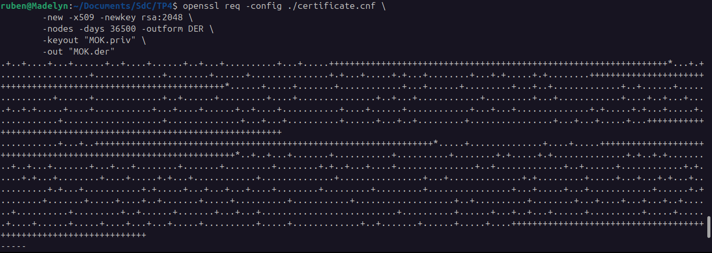
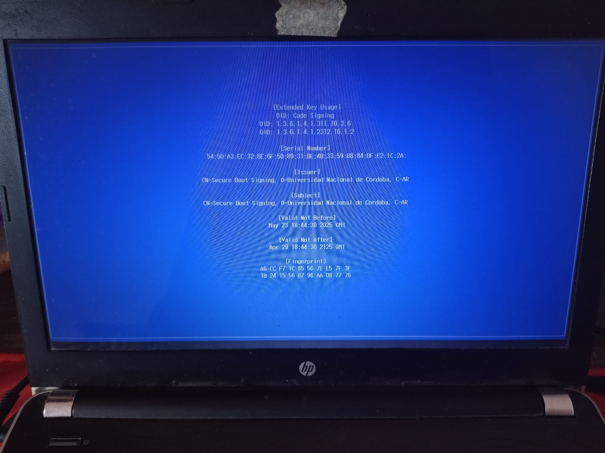
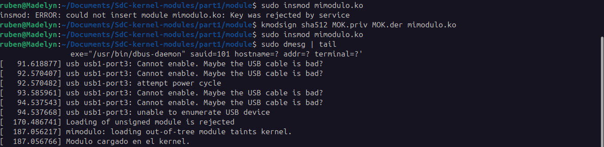

# Firma del modulo `mimodulo`

Para colocar una firma al modulo `mimodulo.ko`, primero se creo un certificado X509 en Shim mediante un archivo de configuración.

```cnf
# certificate.cnf

# This definition stops the following lines choking if HOME isn't
# defined.
HOME                    = .
RANDFILE                = $ENV::HOME/.rnd 
[ req ]
distinguished_name      = req_distinguished_name    # Subject fields (DN)
x509_extensions         = v1                        # Extensions defined in section [v1]
string_mask             = utf8only                  # Force UTF-8 in DN
prompt                  = no                        # Don't ask to introduce DN values

# Optional section. You can also remove it along with the
# "distinguished_name" and "prompt" fields above.
[ req_distinguished_name ]
countryName             = AR
stateOrProvinceName     = Cordoba
localityName            = Cordoba
0.organizationName      = Universidad Nacional de Cordoba
commonName              = Secure Boot Signing
emailAddress            = ruben.zuniga@mi.unc.edu.ar

[ v1 ]
subjectKeyIdentifier    = hash                  # Subject identificator (based on pubkey hash)
authorityKeyIdentifier  = keyid:always,issuer   # Always include keyid and issuer that signed the certificate
basicConstraints        = critical,CA:FALSE     # Requires a strict validation and it's not a Certificate Authority
extendedKeyUsage        = codeSigning,1.3.6.1.4.1.311.10.3.6,1.3.6.1.4.1.2312.16.1.2    # Used to sign modules, Microsoft EKU, Linux kernel EKU (Extended Key Usage)
nsComment               = "OpenSSL Generated Certificate"
```

Luego, se crearon las llaves privadas y publicas.



Para realizar la firma se necesitan ambas, y para "enrollar" la llave en shim se utiliza la publica (MOK.der):


Luego se reinició la maquina y se mostró la pantalla de MokManager antes de la carga de GRUB. Aqui es donde se enrollo la llave.




Finalmente se firmó el modulo de kernel `mimodulo.ko`. A continuacion se muestra la ejecucion del comando `insmod` antes y despues de realizar la firma, todo esto con Secure Boot habilitado.



Se puede verificar si un módulo esta firmado observando que a la salida de `hexdump` se incluya el string "Module signature appended".

