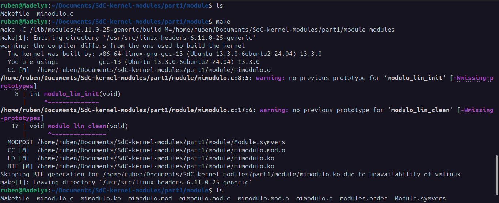
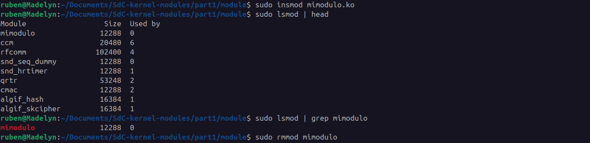
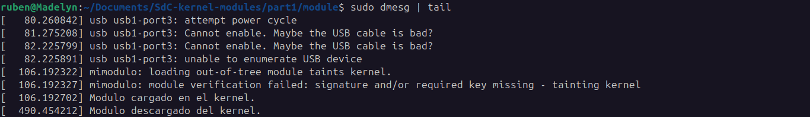
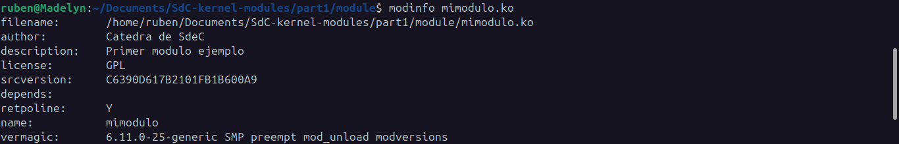
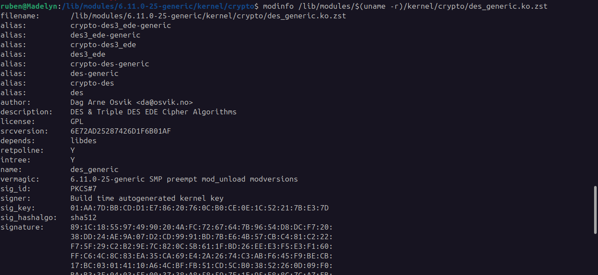

# Primer Modulo

Este modulo solo imprime un mensaje en el registro del kernel cuando se lo carga y cuando se lo descarga.

## Ejecucion

## Makefile

1) `obj-m`: es una variable especial que indica que los objetos listados deben compilarse como módulos (`.ko`).

2) `mimodulo.o`: es el archivo objeto que se generará a partir del código fuente `mimodulo.c`

3) `make -C /lib/modules/$(shell uname -r)/build`: Cambia el directorio de trabajo a la carpeta de fuentes del kernel ya compiladas, necesarias para compilar módulos externos. `$(shell uname -r)` obtiene la versión del kernel que estás usando.

4) `M=$(PWD)`: `M` indica al sistema de compilación del kernel dónde están los archivos fuente del módulo (tu directorio actual). `$(PWD)` es una variable de entorno que da la ruta absoluta del directorio actual.

5) `modules`: le dice al sistema de construcción del kernel que compile los módulos definidos en obj-m desde ese directorio.

Cuando se ejecuta `make clean`, se limpian los archivos generados durante la compilación.

## Inserción

- `sudo insmod mimodulo.ko` inserta el módulo mimodulo.ko en el kernel.

- `sudo lsmod | head` lista los módulos actualmente cargados en el kernel, limitando la salida a las primeras 10 líneas.

- `sudo lsmod | grep mimodulo` lista los modulos que coincidan con "mimodulo".

- `dmesg | tail` muestra las ultimas 10 lineas de los mensajes del registro del sistema (buffer del kernel).

- `sudo rmmod mimodulo` elimina el módulo del kernel.

- `modinfo mimodulo.ko` muestra información detallada sobre el archivo de módulo del kernel.

## Info de este modulo vs modulo de linux

