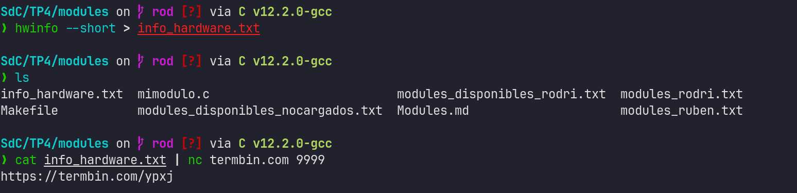
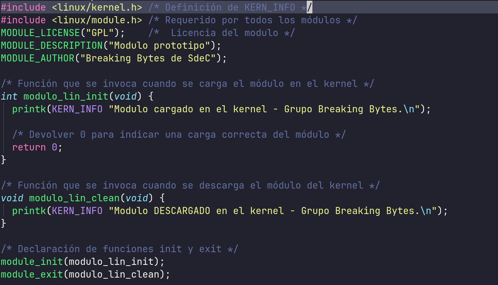
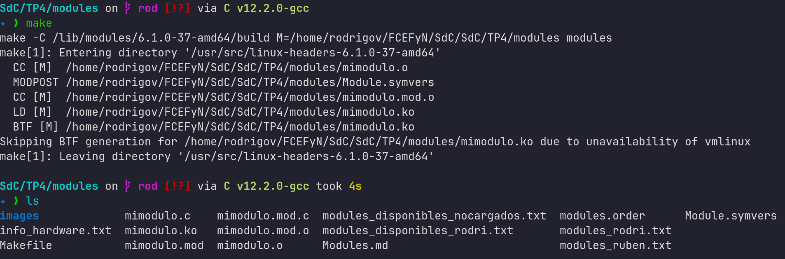
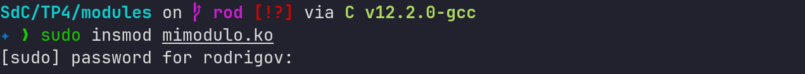
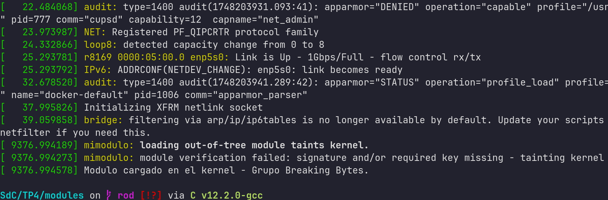
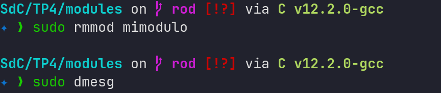
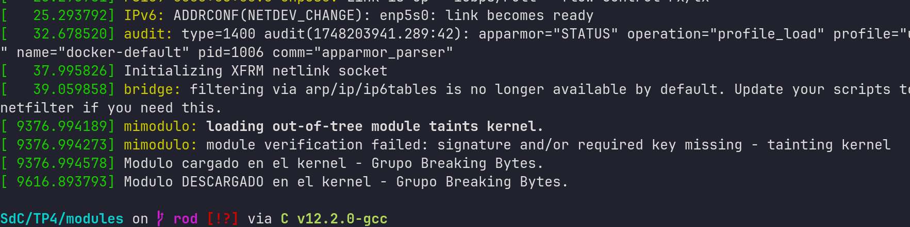

# Modules

## 1. ¿Qué diferencias se pueden observar entre los dos modinfo?

Al comparar la salida de modinfo para un módulo personalizado (mimodulo.ko) con la de un módulo del sistema (/lib/modules/$(uname -r)/kernel/crypto/des_generic.ko), se observan varias diferencias importantes:

#### Ubicación y propósito:

mimodulo.ko es un módulo creado por el usuario, compilado manualmente, y aún no está instalado en el árbol del kernel.

des_generic.ko es un módulo oficial del kernel, ubicado dentro de la jerarquía /lib/modules/, y forma parte del sistema operativo.

#### Firma digital (signature):

des_generic.ko incluye una firma digital que permite verificar su integridad y autenticidad. Esto es importante para sistemas con Secure Boot o políticas estrictas de carga de módulos.

mimodulo.ko no tiene firma digital, lo que es común en módulos desarrollados localmente. Esto puede impedir su carga en sistemas que requieren firma, a menos que se desactive Secure Boot o se firme manualmente.

#### Alias:

des_generic.ko incluye alias que permiten que el kernel lo cargue automáticamente cuando detecta hardware o condiciones específicas asociadas.

mimodulo.ko generalmente no tiene alias definidos, a menos que se especifiquen explícitamente mediante macros como MODULE_ALIAS.

#### Metadatos adicionales:

Los módulos del sistema suelen tener más campos definidos (como srcversion, intree, retpoline, etc.) que indican si el módulo fue construido como parte del árbol oficial del kernel, si soporta mitigaciones de seguridad, entre otros.

En el módulo personalizado, estos campos pueden faltar o tener valores genéricos.

#### Compatibilidad y dependencias:

Ambos módulos incluyen campos como vermagic y depends, pero los del sistema suelen estar más alineados con la configuración actual del kernel, mientras que un módulo personalizado puede generar errores si no fue compilado con los headers correctos.

## 2. Drivers/modulos cargados en nuestras PC's

Cada lista de modulos cargado de cada integrante va a estar en su correspondiente modules_nombre.txt, debajo se hace una comparacion entre los tres

### Diff

## 3.

### a. ¿Cómo ver qué módulos no están cargados pero sí están disponibles?

Estos módulos existen en el sistema pero no están activos (no están cargados en el kernel). Para verlos:

#### 1) Buscar todos los módulos disponibles en tu sistema:

```bash
find /lib/modules/$(uname -r) -type f -name "*.ko*" | xargs -n1 basename | sed 's/\.ko.*$//'

```

- find ... -name "_.ko_": encuentra todos los archivos de módulo (.ko, .ko.xz, etc.).

- xargs -n1 basename: quita la ruta completa, dejando solo el nombre del archivo.

- sed 's/\.ko.\*$//': limpia la extensión (.ko, .ko.xz, etc.) para mostrar el nombre del módulo limpio, tal como aparece en lsmod.

#### 2) Ver los módulos cargados actualmente:

```bash
lsmod
```

#### 3) Dispositivos sin modulos

Podés intentar detectar dispositivos sin driver con

```bash
dmesg | grep -i firmware

```

#### 4) Comparacion de listas

En este caso la comparacion se va a hacer a partir de modules_rodri.txt

##### Obtener la lista de módulos disponibles

```bash
find /lib/modules/$(uname -r) -type f -name "*.ko*" | xargs -n1 basename | sed 's/\.ko.*$//' | sort > modules_disponibles_rodri.txt
```

##### Obtener la lista de módulos cargados

```bash
lsmod | tail -n +2 | awk '{print $1}' | sort > modules_rodri.txt
```

#### Comparar ambas listas

### Módulos disponibles pero no cargados:

```bash
comm -23 modules_disponibles_rodri.txt modules_rodri.txt

```

### Módulos cargados pero no disponibles (esto normalmente no pasa, pero para verificar)

```bash
comm -13 modules_disponibles_rodri.txt modules_rodri.txt
```

comm compara dos archivos línea a línea (los archivos deben estar ordenados).

La columna 1 de comm son líneas únicas del primer archivo.

La columna 2 son líneas comunes.
La columna 3 son líneas únicas del segundo archivo.

### b. ¿Qué pasa cuando un driver (módulo) no está disponible en el sistema?

Hay dos situaciones posibles:

#### No está cargado, pero sí está instalado:

Solución simple: se puede cargar manualmente con modprobe nombre_modulo.

#### No está instalado en absoluto:

El dispositivo probablemente no funcione (por ejemplo, no tenés sonido, red, Wi-Fi, etc.).
No lo vas a ver ni en lsmod ni en /lib/modules/....

Soluciones:

- Buscar e instalar el paquete del driver adecuado (por ejemplo, apt install firmware-realtek).
- En casos más extremos, compilar el módulo vos mismo si es muy específico.

## 4. Usar hwinfo y subir la info a un paste online



### URL:

```plain
- https://termbin.com/ypxj
```

## 5. ¿Qué diferencia existe entre un módulo y un programa ?

### Modulo

Es una pieza de código que se puede cargar o descargar dinámicamente en el núcleo del sistema operativo (kernel) sin necesidad de reiniciar.

- Ejemplo: un controlador (driver) de hardware, como snd_hda_intel.ko para audio o e1000e.ko para una placa de red Intel.
- Se integra directamente con el kernel usando interfaces internas.

Se usa para extender las funcionalidades del kernel, por ejemplo:

- Soporte para nuevos dispositivos
- Sistemas de archivos adicionales
- Protocolo de red adicional

#### Caracteristicas

- No se ejecuta como proceso en espacio de usuario, sino en modo kernel (kernel space).
- Cualquier error puede comprometer la estabilidad del sistema.
- Se cargan con insmod, modprobe y se listan con lsmod.

### Programa

Es una aplicación que se ejecuta en el espacio de usuario.

- Ejemplo: ls, firefox, htop, un juego, o un script de Python.
- Se comunica con el kernel a través de llamadas al sistema (syscalls).

Se utiliza para realizar tareas específicas para el usuario o sistema.

#### Caracteristicas

- Corre como un proceso aislado, protegido del resto del sistema.
- Los errores generalmente no afectan al sistema operativo.
- Se ejecutan desde la terminal o entorno gráfico

## 6. ¿Cómo puede ver una lista de las llamadas al sistema que realiza un simple helloworld en c?

Podés ver las llamadas al sistema que realiza un programa como un hello world en C usando la herramienta strace. Esta herramienta intercepta y muestra todas las syscalls (llamadas al sistema) que realiza un proceso.

## 7. ¿Qué es un segmentation fault? ¿Cómo lo maneja el kernel y como lo hace un programa?

Un segmentation fault (o segfault) es un error que ocurre cuando un programa intenta acceder a una región de memoria que no tiene permiso de usar, ya sea porque:

- No está asignada (por ejemplo, puntero no inicializado o NULL).
- Es de solo lectura y el programa intenta escribir.
- Está fuera del rango válido (como acceder más allá de un array).

En si, un segfault es una forma de violación de segmento: el programa viola las reglas del espacio de memoria que le fue asignado por el sistema operativo.

### ¿Cómo lo maneja el kernel?

Cada proceso tiene un espacio de direcciones virtual definido y protegido.
Cuando el programa intenta acceder a memoria inválida, ocurre una falta de segmentación (page fault).
El kernel detecta que ese acceso no es válido.

Entonces:

- Lanza una señal SIGSEGV al proceso.
- Por defecto, el proceso se termina inmediatamente.
- En consola suele aparecer: Segmentation fault (core dumped)

### ¿Cómo lo maneja el programa?

Un programa puede capturar la señal SIGSEGV usando funciones como signal() o sigaction() para ejecutar código antes de terminar.

- Sin embargo, no se recomienda intentar continuar la ejecución después de una SIGSEGV. Es mejor solo registrar el error y terminar de forma controlada.

### Importancia

- Es un mecanismo de protección: impide que los programas corrompan memoria de otros procesos o del propio kernel.
- Ayuda a detectar bugs graves en el código (punteros mal usados, accesos fuera de rango, etc.).

## 9. Agregar evidencia de la compilación, carga y descarga de su propio módulo imprimiendo el nombre del equipo en los registros del kernel.



### Compilacion utilizando un Makefile

```Makefile
obj-m += mimodulo.o

all:
	make -C /lib/modules/$(shell uname -r)/build M=$(PWD) modules

clean:
	make -C /lib/modules/$(shell uname -r)/build M=$(PWD) clean
```

all es la regla por defecto.

Llama a make dentro del árbol de compilación del kernel actual.

- -C /lib/modules/.../build: entra al directorio con los headers y Makefiles del kernel.
- M=$(PWD): le indica que compile el módulo que está en tu directorio actual.
- modules: objetivo estándar para compilar módulos externos.

Luego con el clean limpia los archivos generados de la compilación (_.o, _.ko, etc.) usando el sistema de build del kernel.



### Carga del modulo utilizando insmod



#### Se verifica con demsg



### Descarga del modulo utilizando rmmod



#### Se verifica con demsg


