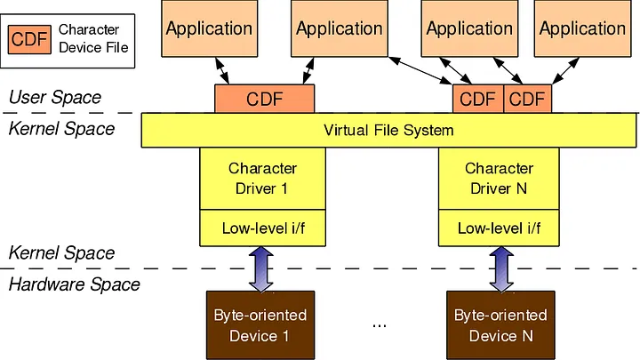

# Trabajo Práctico N°5: Drivers de Dispositivos

### `Breaking Bytes`

- SAILLEN, Simón.
- VARGAS, Rodrigo Sebastian.
- ZÚÑIGA, Guillermo Rubén Darío.

## Introducción

En este informe se abordó el diseño e implementación de *device drivers*, con un enfoque concreto en los *character device drivers*. Partiendo de una revisión de fundamentos teóricos—arquitectura de kernel, registro de dispositivos y mecanismos de comunicación entre espacio de usuario y espacio de kernel—se planteó el desarrollo de un controlador capaz de capturar señales en tiempo real.

El objetivo principal consistió en elaborar un character device driver que lee señales y los transfiere, mediante llamadas de sistema, a una aplicación de espacio de usuario. Esta aplicación además realiza un gráfico temporal de las señales recibidas.

## Desarrollo

### Driver

Un driver (o *controlador*) es un programa que permite la comunicación entre el sistema operativo y un dispositivo de hardware. Los drivers son esenciales para que el sistema operativo pueda interactuar con los dispositivos conectados, como impresoras, discos duros, tarjetas gráficas, etc.

Los drivers son generalmente específicos para cada tipo de dispositivo y sistema operativo. Pueden ser proporcionados por el fabricante del hardware o desarrollados por la comunidad de código abierto. Los drivers pueden ser de espacio de usuario o de espacio del kernel, dependiendo de cómo interactúan con el sistema operativo.

---

### Device Controller

Un device controller (o *controlador de dispositivo*) es un componente electrónico físico, a menudo un chip o una placa de circuito, que se encuentra directamente en el dispositivo de hardware o en la placa base de la computadora. Su función principal es gestionar y controlar las operaciones del dispositivo de hardware al que está asociado. Esencialmente, el device controller maneja las complejidades de bajo nivel del hardware, liberando al procesador principal de esta tarea.

#### Device Drivers

Los device drivers son programas que permiten al sistema operativo comunicarse con los **device controllers**. Estos drivers traducen las solicitudes del sistema operativo en comandos que el device controller puede entender y viceversa. Los device drivers son esenciales para el funcionamiento de los dispositivos de hardware, ya que permiten que el sistema operativo interactúe con el dispositivo a un nivel más abstracto.

---

### Bus Driver

Un bus driver (o *controlador de bus*) es un tipo especializado de driver que se encarga de gestionar la comunicación a través de un bus del sistema. Es un componente crítico en la arquitectura de computadoras, ya que permite que múltiples dispositivos se comuniquen a través de un canal compartido. Los bus drivers son responsables de la gestión de la transferencia de datos entre el bus y los dispositivos conectados, asegurando que los datos se transmitan correctamente y sin conflictos.

Las responsabilidades principales de un bus driver incluyen:

- **Enumerar dispositivos:** Descubrir qué dispositivos están conectados a un bus específico. Por ejemplo, un controlador de bus USB detectará cada nuevo dispositivo USB que se conecte.
- **Gestión del Plug and Play (PnP):** Responder a eventos como la conexión o desconexión de dispositivos y la asignación de recursos (como direcciones de memoria o interrupciones) a esos dispositivos.
- **Arbitraje y Multiplexación:** En buses donde varios dispositivos pueden intentar comunicarse al mismo tiempo, el bus driver se encarga de arbitrar el acceso para evitar colisiones y asegurar una comunicación ordenada.
- **Manejo genérico de dispositivos:** Proporcionar una interfaz común para que el sistema operativo y otros drivers puedan interactuar con los dispositivos conectados a ese bus, sin tener que conocer los detalles específicos de cada dispositivo individual.

---

### CDD: Character Device Driver

Un Character Device Driver (o *controlador de dispositivo de carácter*) es un tipo específico de controlador de dispositivo diseñado para gestionar dispositivos que manejan datos como un flujo de bytes o caracteres individuales, en lugar de bloques de tamaño fijo. A diferencia de los controladores de dispositivo de bloque, los controladores de dispositivo de carácter no suelen implicar el almacenamiento en búfer de grandes cantidades de datos, en cambio, proporcionan una interfaz directa, byte a byte, para que las aplicaciones interactúen con el hardware.

El Sistema Operativo utiliza el CDD para:

- **Leer datos:** Cuando se escribe en un teclado, el CDD lee cada carácter y lo pasa al sistema operativo, que luego lo envía a la aplicación en uso.
- **Escribir datos:** Cuando una aplicación envía datos a un puerto serie o a una impresora, el CDD traduce esos datos a las señales específicas que el hardware entiende, enviándolos carácter por carácter.
- **Controlar operaciones específicas del dispositivo:** Los CDD a menudo incluyen funciones especializadas (como `ioctl` en sistemas tipo Unix) que permiten a las aplicaciones realizar otro tipo de controles que no son solo lectura o escritura de bytes. Por ejemplo, cambiar la velocidad de transmisión (baudios) de un puerto serie.

Para acceder a estos dispositivos, se utilizan los **Character Device Files (CDF)**, que son archivos especiales en el sistema de archivos que representan estos dispositivos. Estos archivos permiten a las aplicaciones interactuar con los dispositivos de carácter como si fueran archivos normales, utilizando las llamadas al sistema estándar para leer y escribir datos. En linux estos archivos se encuentran en el directorio `/dev/`.

Una forma más visual de entender CDF es pensarlo como un modelo de capas, donde el CDF actúa como una interfaz entre el espacio de usuario y el espacio del kernel, permitiendo que las aplicaciones interactúen con los dispositivos de manera abstracta y uniforme:

<div class="image" align="center">
    
</div>

#### Par de Números <Major, Minor>

El vínculo entre un dispositivo (CDF) y su controlador (Device Driver) se establece a través de un par de números conocidos como **Major** y **Minor**. Estos números son utilizados por el kernel para identificar de manera única cada dispositivo y su controlador asociado. Este par de números se puede observar mediante los comandos:

```bash
ls -l /dev/ | grep "^c" # Para listar los archivos de dispositivo de carácter
cat /proc/devices # Para ver los números Major
ls -la /dev/hda? /dev/sda? /dev/ttyS? # Para ver los números Major y Minor de dispositivos específicos
```

Por ejemplo, al ejecutar `ls -l /dev/ttyS0`, se puede ver algo como:

```console
crw-rw---- 1 root dialout 4, 64 jun  8 16:31 /dev/ttyS0
```

En este caso, el número `4` es el **Major** y `64` es el **Minor**, formando el par **<4, 64>**. El Major identifica el tipo de dispositivo (en este caso, un dispositivo de carácter), mientras que el Minor identifica una instancia específica del dispositivo (por ejemplo, el primer puerto serie).

---

### DESAFIO: Construcción de un CDD para Sensar Señales

Se desarrolló un Character Device Driver (CDD) que genera dos señales periódicas con un periodo de 1 segundo. Luego se implementó una aplicación a nivel de usuario que lee una de las dos señales y la grafica en función del tiempo. La aplicación tambien puede indicarle al CDD cuál de las dos señales leer. 

Las correcciones de escalas de las mediciones, se realizan a nivel de usuario. Los gráficos de la señal indican el tipo de señal que se está sensando, con unidades en abscisas y tiempo en ordenadas. Cuando se cambia de señal el gráfico se "resetea" y acomoda a la nueva medición.

>[!NOTE]
>La idea original de este trabajo era sensar señales de pines GPIO. Para ello se trató de emular una Raspberry Pi en QEMU, sin embargo esto no dio resultado, por lo que se optó por desarrollar un CDD que genere las señales.

#### Paso 1: Estructura básica del módulo

La estructura básica del módulo incluye:

- Inclusión de headers necesarios (`linux/module.h`, `linux/fs.h`, etc.).
- Definición de variables globales para el manejo de señales y sincronización.
- Implementación de las funciones principales del driver: `open`, `read`, `release` y `ioctl` (o `unlocked_ioctl`).
- Definición de una estructura `file_operations` que asocia las funciones del driver con las operaciones de archivo correspondientes.
- Inicialización y limpieza del módulo mediante las funciones `module_init` y `module_exit`.

#### Paso 2: Carga y registro del módulo como dispositivo de carácter

Para registrar el driver como un dispositivo de carácter:

- Se utiliza `register_chrdev` para obtener un número mayor dinámico y asociar el driver con el sistema.
- Se crea el archivo de dispositivo correspondiente en `/dev/` usando `mknod` o mediante `udev`.
- El módulo implementa las funciones de inicialización y salida para registrar y desregistrar el dispositivo correctamente.
- Se asegura la correcta gestión de recursos y la liberación de memoria al remover el módulo.

#### Paso 3: Personalización y Extensión del Módulo

Las modificaciones específicas realizadas en el archivo `CDD/signal_driver.c` incluyen:

- Implementación de dos generadores de señal (cuadrada y triangular) usando la estructura `struct timer_list` para temporización periódica.
- Definición de una variable global para seleccionar la señal activa, modificable desde espacio de usuario mediante la función `ioctl`.
- Uso de una cola de espera (`wait_queue_head_t`) para sincronizar la entrega de muestras y evitar condiciones de carrera entre el temporizador y la función `read`.
- Adaptación de la función `read` para que devuelva un byte correspondiente a la muestra más reciente de la señal seleccionada, bloqueando hasta que haya una nueva muestra disponible.
- Reinicio del estado interno de la señal y notificación a la aplicación usuaria mediante la cola de espera cuando se cambia la señal seleccionada con `ioctl`.

#### Paso 4: Implementación de la Aplicación de Espacio de Usuario

La aplicación de espacio de usuario se encarga de:

- Abrir el dispositivo de carácter creado por el driver.
- Leer los datos de la señal seleccionada mediante llamadas al sistema.
- Graficar los datos recibidos utilizando una biblioteca de gráficos (como `matplotlib` en Python).
- Permitir al usuario seleccionar entre las dos señales disponibles (cuadrada o triangular) y actualizar el gráfico en consecuencia.

#### Paso 5: Pruebas y Verificación

Para verificar el correcto funcionamiento del driver y la aplicación:

1. Se compila el módulo del kernel:

Para realizar este paso, se debe ejecutar primero el Makefile:

```bash
cd CDD
make
cd ..
```

2. Se carga el módulo en el kernel con nuestro script:

```bash
sh run_program.sh
```

>[!NOTE]
>El script `run_program.sh` compila el módulo, lo carga en el kernel y ejecuta la aplicación de espacio de usuario. Verificando que el módulo se haya cargado correctamente con `lsmod` y que el dispositivo esté presente en `/dev/`. Tambien verifica el estado del secure boot, ya que este puede impedir la carga de módulos no firmados.

3. Se ejecuta la aplicación de espacio de usuario, que se encarga de leer y graficar las señales.

```bash
cd user
python3 app.py
```

#### Paso 6: Visualización de Resultados

<div class="image" align="center">
    
</div>

## Conclusion

El resultado de este trabajo consistió, por un lado, en un controlador de dispositivo de caracter capaz de generar dos señales variables en el tiempo y de enviar estos valores, un byte a la vez. Por otro lado, también se logró desarrollar una aplicación de capa superior que representa gráficamente una de las dos señales, según elección del usuario. Se plantea como posible mejora la adaptación de este driver para la detección de señales que ingresan por pines GPIO en un sistema embebido como Raspberry Pi.